# StitchMesh — Complete User Manual

*"Modify, don't model."* StitchMesh is an offline tool for making localized
edits to an existing `.stl` file — resize a hole, add a threaded boss, cut
a model in two and move the pieces apart, measure a clearance — without
learning a full CAD package.

This manual walks through every feature with screenshots so you can find
what you need quickly.

---

## 1. What StitchMesh is

A four-panel app: a **toolbar** across the top (file, undo/redo, view,
printer, display toggles), a collapsible **Parts panel** on the left
listing every object in the scene as its own layer, a **3D viewport**
filling the center, and a **context sidebar** on the right with seven tool
tabs whose contents change based on which is active: **Info, Transform,
Hole, Primitive, Cut, Move, Measure**.


*Empty state. Toolbar across the top (Open STL, Add Part, Export STL, New,
Undo/Redo, view presets, printer picker, display toggles). Parts panel on
the left, empty. Dark viewport with a grid and axes gizmo. Sidebar
defaulted to Info, reporting "No model loaded."*

StitchMesh is a single self-contained HTML file. Double-click it to open it
in your browser and it works fully offline — no install, no server, and
nothing is ever sent over the internet. Importing reads your `.stl` file
straight into memory, and exporting saves a new file through your
browser's normal download flow, so your source file is never modified.

---

## 2. Loading, adding, exporting, and resetting a model

- **Import**: drag an `.stl` onto the viewport, or click **Open STL** to
  pick a file. This *replaces* everything currently in the scene. Reading
  a file never modifies it on disk.
- **Add Part**: imports another `.stl` as a second, independent object
  next to the first, rather than replacing it — see §5 (Parts Panel).
  If nothing is loaded yet, Add Part behaves exactly like Open STL.
- **New**: clears the current model (and its undo history). Asks for
  confirmation first if a model is loaded.
- **Export STL**: saves the current scene — every part in it — as a new
  file, downloaded as `<original-name>-modified.stl`. Your source file is
  never overwritten.

**Printer-not-selected export gate**: the first time you click Export STL
without having picked a printer profile (§14), a dialog interrupts:
*"No printer selected yet... Click OK to export anyway with Generic, or
Cancel to pick your printer first."* Accepting confirms Generic so it
won't ask again.


*After import: the model renders, the part appears in the Parts panel on
the left, and the Bounding Box readout (visible on every tab) reports the
**selected part's** live X × Y × Z dimensions in millimeters.*

---

## 3. Viewport navigation

- **Orbit**: left-click-drag, or **middle-click-drag**.
- **Pan**: right-click-drag.
- **Zoom**: scroll wheel.
- **Middle-click-drag re-centers on whatever's under the cursor** the
  moment you press the button, rather than orbiting around a fixed point
  — click near a corner and drag, and the view pivots around that corner.
  Left-drag orbits around the same shared pivot.
- **View presets** (toolbar): **Top / Front / Side / Iso**, or press
  **1 / 2 / 3 / 4** on the keyboard.


*Top preset. Presets re-frame and re-target the camera to the whole
scene's **current** bounding box, so they stay useful after scaling,
moving parts apart, or cutting.*

**Display toggles** (toolbar icons, or keyboard **W** / **B**):

| Icon / key | Toggle | Effect |
|---|---|---|
| Grid icon / `W` | Wireframe | Renders the model as an edge mesh |
| Cube icon | Flat shading | Faceted instead of smooth shading — shows actual triangle density |
| Layers icon / `B` | Bounding box | Shows/hides the blue outline around the **selected part** (on by default) |


*Wireframe on, from the Iso preset.*

### Keyboard shortcuts reference

| Key | Action |
|---|---|
| `Ctrl`/`Cmd` + `Z` | Undo |
| `Ctrl`/`Cmd` + `Y`, or `Ctrl`/`Cmd` + `Shift` + `Z` | Redo |
| `1` `2` `3` `4` | Top / Front / Side / Iso |
| `W` | Toggle wireframe |
| `B` | Toggle bounding box |

Shortcuts are suppressed while typing in any text field or dropdown.

---

## 4. Undo / Redo

Toolbar: the two curved-arrow icons next to New, or `Ctrl+Z` / `Ctrl+Y`.
Every committed change is undoable: Hole/Primitive/Plane Cut apply,
feature edits and deletes, Transform actions (scale, rotate, center, drop,
mirror), Move, adding a part, and mesh repair. Continuous edits (typing
digits into a Scale or Move field) are coalesced into a single undo step
per edit session rather than one step per keystroke; discrete actions (a
button click) are always their own step.

 

*Left: a hole applied. Right: immediately after `Ctrl+Z` — back to the
unmodified cube. Redo (button or `Ctrl+Y`) reapplies it.*

---

## 5. Parts panel: layers, features, and local origin

The **Parts** panel on the left lists every object currently in the scene
— the first import and anything added afterward — as its own **layer**,
collapsible via the `«` button in its header.

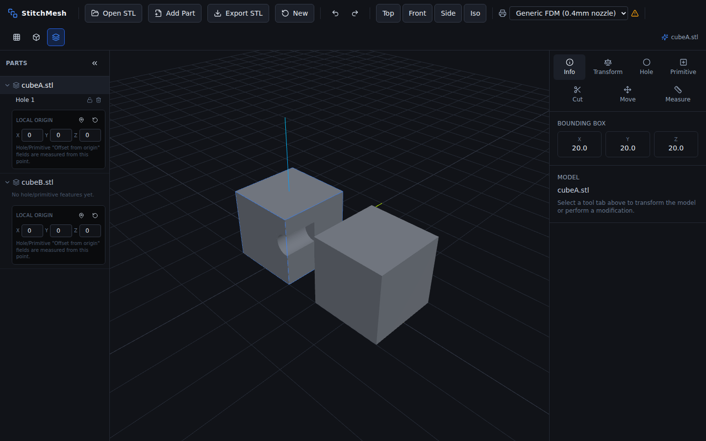

*Two independent parts. `cubeA.stl` has one feature nested under it,
**Hole 1** — its own lock and delete icons sit to the right of the label.
`cubeB.stl` has none yet. Each part also carries its own Local Origin
editor (see below).*

**Each part is fully independent** — this is the fix for a real bug in an
earlier build, where scaling, rotating, centering, or dropping one part
after moving another moved or resized *both*. Selecting a part (click its
row, or use the **Part** dropdown on the Move/Cut tabs) makes it the
target for Transform, Move, Mirror, and Plane Cut; none of those actions
touch any other part.

### Feature layers

Every Hole and Primitive you apply becomes its own named layer nested
under its part (`Hole 1`, `Add cylinder 1`, `Cut cylinder 2`, …) instead
of being baked in and forgotten:

- **Click a feature's name** to reopen it in the Hole/Primitive panel with
  its exact diameter, depth, thread, and position — change anything and
  click **Save Changes**, or **Delete Feature** to remove it entirely.
- **Lock icon** — freezes a feature (including its thread/diameter) so it
  can't be accidentally changed; click the feature and every field is
  replaced with a locked notice until you unlock it again from the same
  icon.
- **Delete icon** (trash) — removes that one feature immediately (with a
  confirmation-free but fully undoable delete — `Ctrl+Z` brings it right
  back).

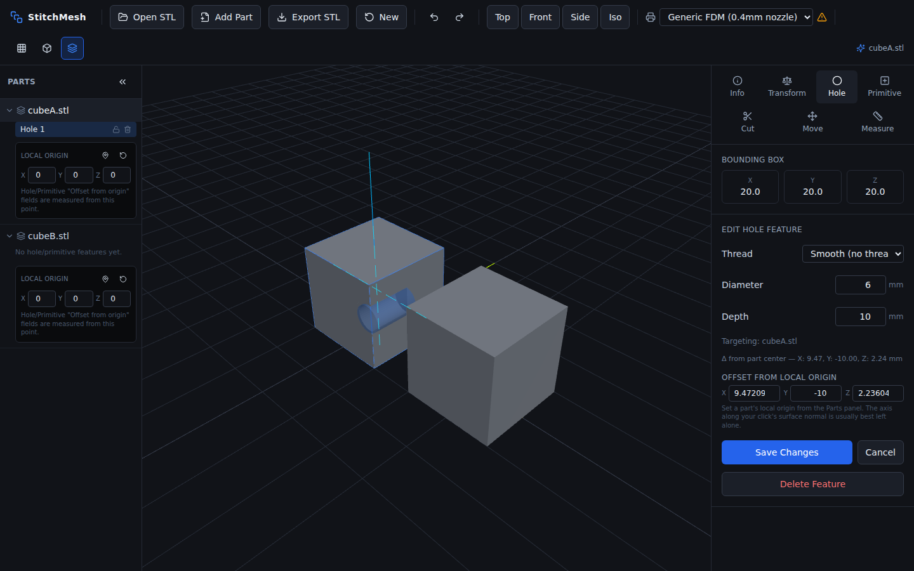

*Clicking **Hole 1** reopens it for editing: the sidebar shows its current
Diameter/Depth/Thread, a Δ-from-center readout, and Offset-from-origin
fields (below). Two dashed cyan lines mark the part's own center on the
two axes not aligned with the hole's drilling direction, so you can see at
a glance how far off-center it sits.*

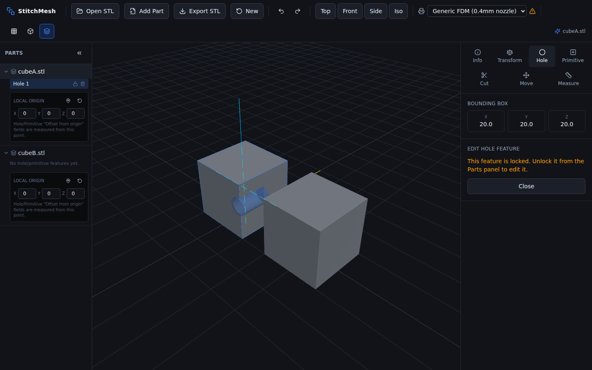

*Reopening a locked feature shows a notice instead of editable fields.
Unlock it from the Parts panel (the same lock icon) to make changes again.*

**One tradeoff worth knowing**: features stay independently editable only
as long as you don't change that part's *scale*. Scaling a part (Transform
→ Scale) permanently folds every existing feature on that part into its
base shape — the holes/bosses stay exactly where they are, just no longer
individually re-editable afterward. Add or edit features after you've
settled on a part's final scale to keep them adjustable.

### Local origin

Each part can have its own reference point — independent of world (0,0,0)
— for typing exact Hole/Primitive positions instead of eyeballing a click.
Under a part's feature list:

- **Pin icon** — click, then click a point on that part in the viewport to
  set the origin there (e.g. a corner of a block).
- **Reset icon** — puts the origin back at the part's own center.
- **X / Y / Z fields** — type an exact origin position directly.

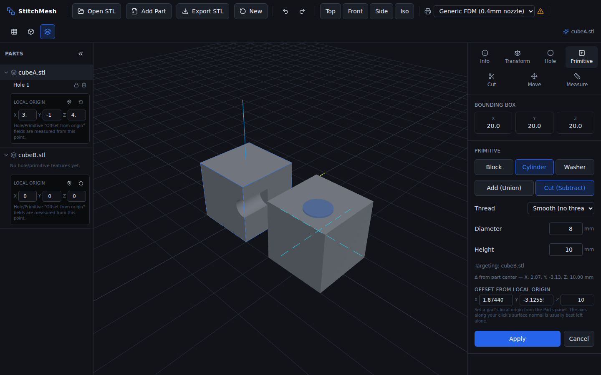

*The origin was picked at a corner of `cubeA.stl` (fields read roughly
−15, −10, ~0). Placing a primitive on the neighboring part then shows
**Offset from local origin** X/Y/Z fields — type an exact position (e.g.
X = 5, Z = −8) instead of relying on where you clicked. The axis running
along your click's surface normal is usually best left alone, since
changing it can lift the feature off the part's surface entirely.*

This is the tool for the "block with two holes a precise quarter-inch from
each edge" case: set the origin at a bottom corner of the face you care
about, click roughly the right face to establish the drilling direction,
then type the exact X/Y/Z offsets for each hole.

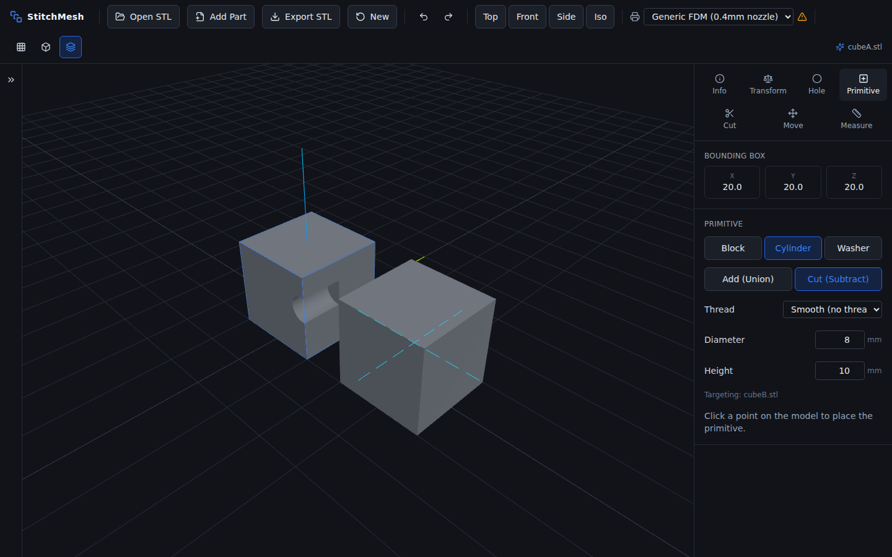

*Collapsed to a thin strip via the `«` button — click the arrow to expand
it again. The panel remembers nothing is lost; it's purely a display
toggle.*

---

## 6. Transform tool

Tab: **Transform**. Affects only the **selected part** (Parts panel, or
any part-picking dropdown) — every other part in the scene is left alone.


- **Scale** — X/Y/Z fields show the selected part's current size in mm;
  typing a new value rescales it to that exact size. **Uniform** (on by
  default) keeps all three axes proportional when editing one field. See
  §5 for how scaling interacts with that part's existing features.
- **Rotate** — ±90° snap buttons per axis, plus a **free-angle** row:
  pick an axis, type any number of degrees, click **Rotate**. Both use the
  same underlying rotation — the snap buttons are just a fast path for the
  most common angle. Rotating re-drops the part to the build plate
  afterward.
- **Center to Origin** — recenters that part's bounding box at world
  (0,0,0) on all three axes.
- **Drop to Build Plate** — Z-only: shifts so the part's lowest point sits
  at Z=0. Runs automatically once on import too.
- **Mirror** — flips the part across X, Y, or Z through its own center.
  Unlike a naive negative-scale mirror (which leaves every face pointing
  the wrong way and, on a part not centered at the world origin, would
  relocate it entirely), StitchMesh bakes the mirror into the geometry in
  that part's own local frame, with corrected winding, so it flips exactly
  in place and raycasting/further edits keep working correctly afterward.

---

## 7. Hole Modifier

Tab: **Hole**. Cuts a cylindrical (or threaded) hole at a point you click.

**Workflow**: click **Hole** → click a point on any part's surface → the
sidebar shows Diameter, Depth, Thread, an offset/center readout, and
**Apply Boolean Subtract** / **Cancel**. The part you clicked becomes the
target automatically — no extra selection step, even with multiple
objects in the scene. The result is saved as its own editable layer under
that part — see §5 to reopen, lock, or delete it later.

- **Diameter** / **Depth** (mm) — free-typed when Thread is "Smooth (no
  thread)". **Depth means depth**: the full stated value is removed from
  the material, drilling *into* the surface from the clicked point (not
  split half in/half out).
- **Thread** — a dropdown of standard hardware sizes (§13). Picking one
  locks Diameter to that thread's exact major diameter and cuts a real
  helical thread instead of a smooth cylinder.
- **Δ from part center** / **Offset from local origin** — two reference
  readouts (§5) once the cutter is placed. The offset fields are editable:
  type exact X/Y/Z numbers to nudge the hole precisely instead of
  re-clicking.

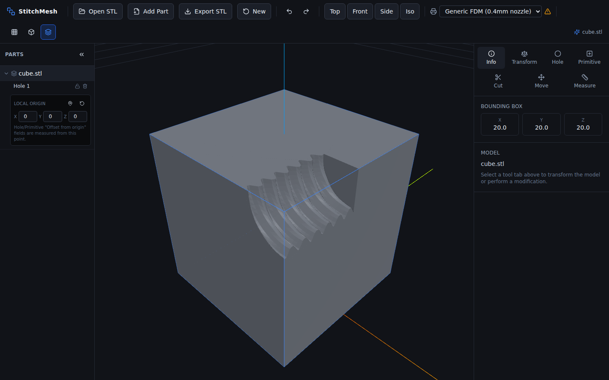

*3/8-16 UNC hole applied: a visible internal thread spiraling down the
bore, generated from the same geometry a real tap would cut.*

---

## 8. Primitive Add/Subtract

Tab: **Primitive**. Places a block, cylinder, or washer and unions (adds)
or subtracts it from a part at a clicked point — same click-to-place,
auto-targeting flow as Hole, and it's saved the same way: as its own
editable, lockable, deletable layer under the target part (§5).

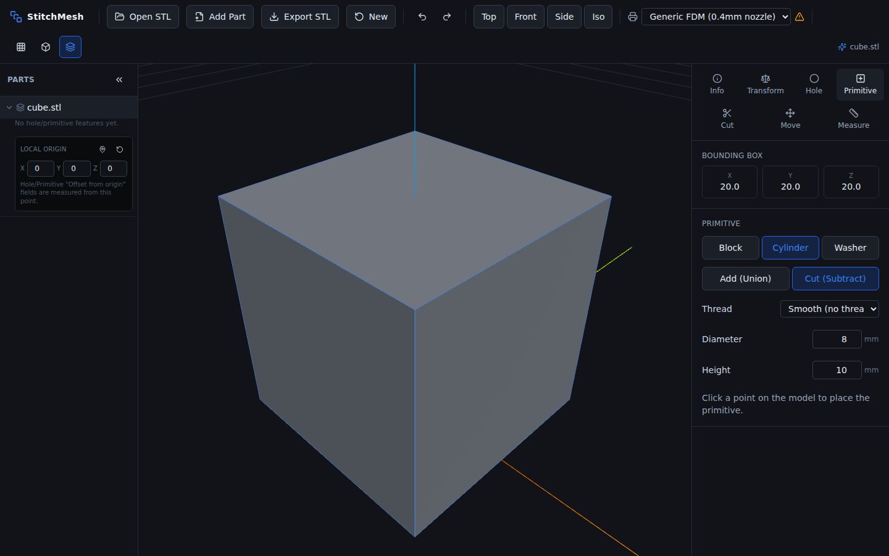

- **Shape**: Block / Cylinder / Washer.
- **Operation**: **Add (Union)** fuses it onto the model as a new
  protrusion; **Cut (Subtract)** carves it out as a cavity.
- **Dimensions**: Block gets Width/Depth/Height; Cylinder gets
  Diameter/Height; Washer gets Outer/Inner Diameter/Height.
- **Thread** (Cylinder only): same dropdown as Hole. With **Add** it
  becomes an external thread (a boss/stud); with **Cut** an internal
  thread (a tapped hole) — the caption updates to say which.

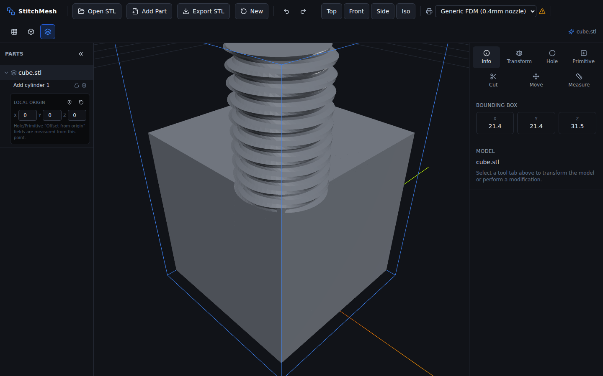

*M8 × 1.25, Add (Union), 12mm tall, placed on the top face. Bounding-box Z
grew from 20.0 to 31.5mm — the full 12mm (minus a deliberate ~0.5mm embed
fused into the surface for a clean, non-degenerate boolean). It shows up
in the Parts panel as "Add cylinder 1" under the target part.*

---

## 9. Plane Cut

Tab: **Cut**. Splits the target part into **two independent, separately
selectable parts** along an axis-aligned plane.

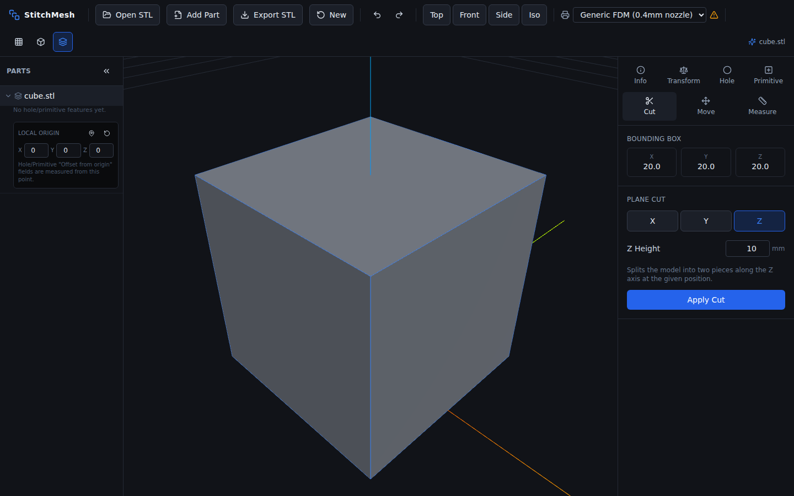

- **Part** selector — only shown once more than one part exists.
- **Axis** — X / Y / Z, the cutting plane's normal.
- **Height** — the plane's position on that axis. Auto-defaults to the
  target's actual center whenever you open the tool or change axis (a
  model sits on the build plate, so a fixed 0 default would cut at the
  very bottom edge and remove nothing).
- **Apply Cut** — both resulting pieces are kept, appear as two new
  entries in the Parts panel labeled `(upper)` and `(lower)`, and are
  exported together. They start out sitting exactly where the original
  was — see the Move tool to actually pull them apart. Neither piece
  carries over the original part's feature layers as editable — the cut
  bakes the shape as it stood at that moment into each new piece's own
  base.

---

## 10. Move tool

Tab: **Move**. Selects a part and repositions it — this is what actually
separates Plane Cut's two halves (or arranges an added part).

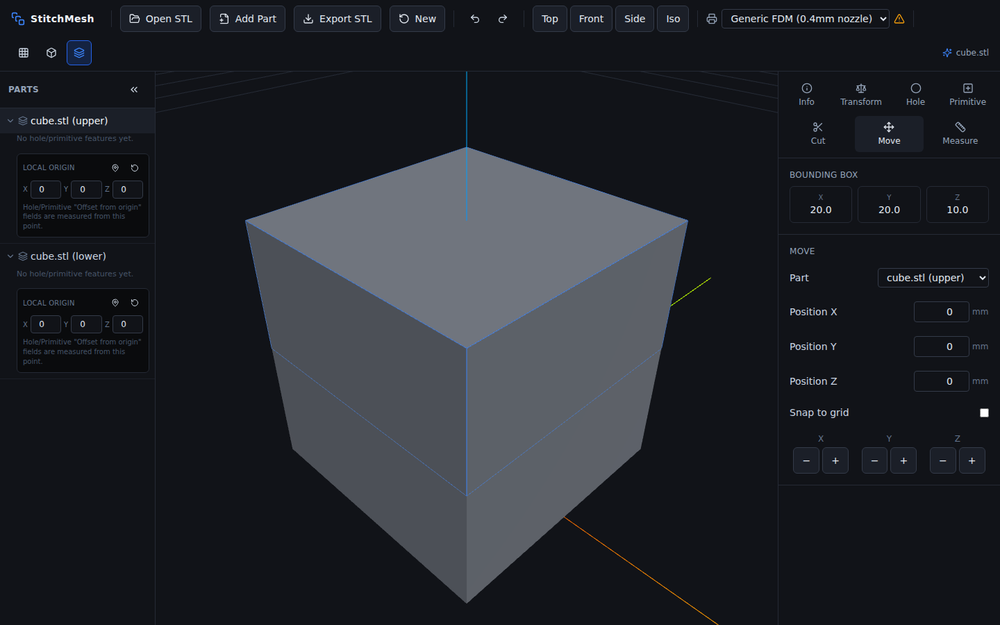

*Right after a Plane Cut: two selectable parts exist in the Parts panel
(`cube.stl (upper)` / `(lower)`), but they still occupy the same space.*

- **Part** dropdown — pick which object to move (hidden with only one
  part; you can also just click its row in the Parts panel).
- **Position X / Y / Z** — absolute world position in mm; typing a value
  moves the part there directly.
- **Snap to grid** — checkbox; when on, typed positions round to the
  nearest 1mm.
- **Nudge buttons** (−/+ per axis) — step by the grid size (1mm, or the
  snap size if enabled).

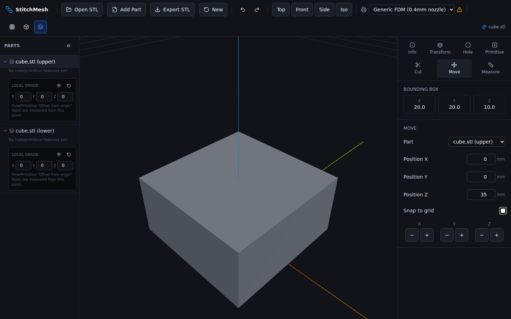

*The `(upper)` piece moved to Z=35: the two halves are now visibly
separate, independently selectable, and still export together.*

---

## 11. Measurement tool

Tab: **Measure**. Click a **datum** (reference point), then click a second
point to read the distance and per-axis offset — useful for checking
clearances before committing to a hole or thread size.

**Workflow**: click **Measure** → click a point on the model (sets the
green datum marker) → click another point (orange marker + a white
connecting line) → the panel shows straight-line **Distance** and
**ΔX / ΔY / ΔZ**. Click again anywhere to re-measure from the same datum
without resetting it. **Reset Datum** clears both points.

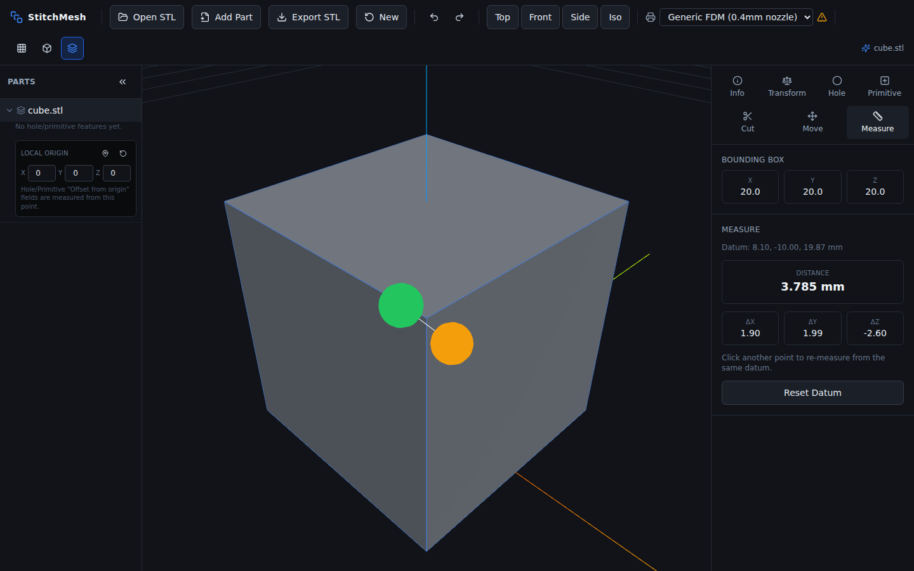

*Datum (green) and measured point (orange) on the same cube, with the
distance and per-axis deltas shown in the panel.*

---

## 12. Mesh validation & auto-repair

Every import — the first model or an added part — is checked for two
kinds of defect and handled differently:

- **Inconsistent or inverted face winding** (a common real-world defect —
  a few faces flipped, or occasionally an entire mesh reading inside-out)
  is detected and **automatically repaired**, silently, before you ever
  see the model. This matters because StitchMesh's click-to-place tools
  read the *actual* face winding to know which way is "outward" — an
  unrepaired flipped face would drill in the wrong direction. Repair runs
  in two passes: a local pass that unifies winding within each connected
  patch of geometry (by majority vote against its neighbors), then a
  global pass that flips the whole mesh if it still reads inside-out
  overall.
- **Open boundary edges** (holes) or **non-manifold edges** (edges shared
  by three or more triangles — not a valid solid) are **not** auto-fixed,
  since closing a hole means guessing a shape. Instead, a dismissible
  banner appears in the toolbar.


*A model with one triangle deliberately removed: "cube-with-hole.stl: 3
open edge(s)" with a dismiss (✕) button. The banner is informational only
— StitchMesh doesn't attempt to fill the hole automatically.*

---

## 13. Thread generator & standard sizes

Both the Hole and Primitive (cylinder) tools share one **Thread** dropdown
with three groups:

- **Metric (ISO)**: M2, M2.5, M3, M4, M5, M6, M8, M10, M12, M14, M16, M18, M20 (coarse pitch)
- **Unified Coarse (UNC)**: #4-40, #6-32, #8-32, #10-24, 1/4-20, 5/16-18, 3/8-16, 7/16-14, 1/2-13, 5/8-11, 3/4-10
- **Unified Fine (UNF)**: #4-48, #6-40, #8-36, #10-32, 1/4-28, 5/16-24, 3/8-24, 7/16-20, 1/2-20, 5/8-18, 3/4-16

Picking a size generates an actual helical 60° V-thread mesh, from the
fundamental-triangle geometry both standards share (ISO 68-1 for metric,
ASME B1.1 for Unified):

```
H (fundamental triangle height) = 0.866025 × pitch
pitch diameter                  = major diameter − 0.649519 × pitch
minor diameter                  = major diameter − 1.082532 × pitch
crest truncated by H/8, root truncated by H/4
```

These constants were cross-checked against known published table values
(M6×1.0 → minor diameter 4.917mm; M10×1.5 → pitch diameter 9.026mm) — both
matched exactly. An internal (tapped) thread and an external (screw)
thread are the *same* nominal profile — the generator is reused as a
subtraction cutter for one and a union addition for the other, exactly
like a real tap cuts the mating shape of the bolt it's sized for. See
`src/utils/threadGeometry.ts` for the profile math and
`src/utils/threadStandards.ts` for the size table.

---

## 14. Printer profiles

The toolbar's **Printer** dropdown tunes every threaded feature to a
specific machine:


*Default: "Generic FDM (0.4mm nozzle)" with a warning triangle — shown
whenever Generic is active, confirmed or not, since the underlying concern
(no machine-specific tuning) is still true either way.*


*After picking "Prusa MK4": the warning icon clears.*

What the profile changes:

- **Mesh resolution** — radial facets and helical height-rings sized to
  the printer's nozzle/spot diameter and typical layer height.
- **Internal-thread clearance** — a small diametral clearance added to
  tapped holes (0.25–0.35mm for FDM depending on machine, 0.1mm for resin)
  so a print accepts a real bolt despite typical over-extrusion.
- **Printability warning** — in the Thread panel, when a pitch is finer
  than the nozzle can resolve, or the size is small enough (below roughly
  M4/#8) that a threaded insert would print more reliably.

Included: Generic FDM, Bambu Lab X1 Carbon, Bambu Lab P1S, Prusa MK4,
Creality Ender 3 V2, Creality K1C, Voron 2.4 (350mm), Ultimaker S5, Elegoo
Saturn 3 (resin), Formlabs Form 4 (resin).

---

## 15. Every control, at a glance

| Location | Control | Does |
|---|---|---|
| Toolbar | Open STL | Import an `.stl`, replacing the scene (drag-and-drop works too) |
| Toolbar | Add Part | Import an `.stl` as a new independent object |
| Toolbar | Export STL | Save the current scene as a new `.stl` |
| Toolbar | New | Clear the model (confirms first) |
| Toolbar | Undo / Redo | Step back/forward through edit history (`Ctrl+Z` / `Ctrl+Y`) |
| Toolbar | Top / Front / Side / Iso | Jump to a preset camera framing (`1`–`4`) |
| Toolbar | Printer dropdown | Select target printer; tunes thread resolution/clearance |
| Toolbar | Wireframe / Flat shading / Bounding box | Display toggles (`W` / — / `B`) |
| Parts panel | Part row | Select that part as the active target; expand/collapse its features |
| Parts panel | Feature row | Reopen a Hole/Primitive for editing |
| Parts panel | Lock icon | Freeze/unfreeze a feature against edits |
| Parts panel | Trash icon | Delete a feature |
| Parts panel | Pin / Reset / X,Y,Z | Set, reset, or type a part's local origin |
| Parts panel | `«` / `»` | Collapse/expand the whole panel |
| Sidebar → Info | (read-only) | File name, selected part's bounding box |
| Sidebar → Transform | Scale X/Y/Z, Uniform | Resize the selected part |
| Sidebar → Transform | Rotate ±90° (×3 axes), Free angle | Rotate the selected part |
| Sidebar → Transform | Center to Origin, Drop to Build Plate | Reposition the selected part |
| Sidebar → Transform | Mirror X/Y/Z | Flip the selected part |
| Sidebar → Hole | Diameter, Depth, Thread | Configure a hole cutter after clicking a point |
| Sidebar → Hole | Offset from local origin X/Y/Z | Fine-tune placement numerically |
| Sidebar → Hole | Apply Boolean Subtract / Save Changes / Cancel / Delete Feature | Commit, update, discard, or remove |
| Sidebar → Primitive | Shape, Operation, dimensions, Thread | Configure a primitive after clicking a point |
| Sidebar → Primitive | Offset from local origin X/Y/Z | Fine-tune placement numerically |
| Sidebar → Primitive | Apply / Save Changes / Cancel / Delete Feature | Commit, update, discard, or remove |
| Sidebar → Cut | Part, Axis, Height, Apply Cut | Split the target part in two |
| Sidebar → Move | Part, Position X/Y/Z, Snap, nudge | Reposition a part |
| Sidebar → Measure | (click viewport) | Set datum, measure distance/deltas |
| Viewport | Left/middle-drag, right-drag, scroll | Orbit, pan, zoom |

---

## 16. Accuracy & validity review

A full-codebase review (an automated correctness pass, plus manual
re-derivation of the placement math for every tool) has been run three
times across this project's development. All findings below are **already
fixed**.

**From the first two passes:**
1. **Hole/Primitive depth was silently halved** — the cutter was centered
   on the clicked point instead of driven into the surface. Fixed
   (`positionCutterAtSurface`); confirmed by drilling a hole deeper than
   the material and verifying it broke through the far face.
2. **Plane Cut's default height (0) was a silent no-op** on any
   build-plate-dropped model. Fixed to auto-default to the target's
   actual center.
3. A coordinate-space bug (using each mesh's local transform instead of
   its world transform in the CSG boolean) that could silently miss
   entirely after a prior scale/rotate. Fixed; still holds under every
   later round of testing.
4. Mesh repair, Mirror, undo/redo, snap-to-grid, and free-angle rotation
   were each verified with dedicated synthetic tests (deliberately flipped
   and inside-out meshes, an intentional open hole, exact round-trip
   triangle counts across apply → undo → redo, fractional-position
   snapping, and 45° rotation bounding-box math) — all correct.

**From the parts/layers pass (this revision):**
- **The headline bug**: Transform's Scale, Rotate, Center to Origin, and
  Drop to Build Plate previously acted on the whole scene instead of the
  selected part — scaling or dropping one part after moving another moved
  or resized both. Root-caused to Hole/Primitive booleans baking each
  part's *world* transform into its geometry, which forced every part to
  share one transform. Fixed by compositing Hole/Primitive features
  entirely in each part's own stable local frame instead — Transform now
  acts on exactly one part's own mesh, verified by scaling, rotating,
  centering, and dropping one part of a two-part scene and confirming the
  other's position stayed byte-for-byte identical.
- The same local-frame fix also closed a latent Mirror bug: mirroring a
  part that wasn't centered at the world origin (e.g. a second part
  imported beside the first) would relocate it across the world origin
  instead of flipping it in place. Verified by mirroring an off-center
  part and confirming its bounding box stayed exactly where it was.
- The full feature-layer lifecycle — add, reopen and edit, lock (and
  confirm locked fields can't be changed), delete, and confirm the layer
  list updates correctly — was verified end-to-end, along with local-origin
  picking and numeric offset placement round-tripping correctly.
- Plane Cut was re-verified to still produce two independently selectable,
  movable parts after the rework.

**Everything was re-verified end-to-end** in a real browser, offline, with
**zero console errors** across every test.

**Known limitations** (not bugs, but worth knowing):

- **No hole-filling.** Mesh repair fixes winding but doesn't attempt to
  triangulate and close actual holes/non-manifold topology — those are
  reported, not fixed.
- **Thread mesh triangle counts scale up fast.** A fine-pitch thread over
  a long depth can generate 10,000+ triangles.
- **Scaling a part flattens its existing features.** Once you scale a
  part, any holes/primitives already on it stop being independently
  re-editable (they're folded into its base shape) — see §5. New features
  added after that scale are unaffected.
- **Plane Cut and Mirror don't preserve feature layers.** Both operate on
  the part's current compiled shape and produce a new part/base with no
  separately editable feature history, even if the original had some.
- **No feature reordering.** Features composite in the order you added
  them; there's no drag-to-reorder yet.
- **Snap-to-grid applies to the Move tool only**, not to Hole/Primitive
  click placement (snapping a raycast hit point to a grid could shift it
  off the actual surface).
- **Single-level undo/redo stack**, capped at 25 steps.

---

## 17. Possible future features

Most of what was on this list in earlier revisions of this manual is now
built. What's still genuinely missing, for a future pass:

1. **Hole-filling / non-manifold repair** — closing actual holes, not just
   fixing winding.
2. **A true 3D transform gizmo** (drag arrows/rings in the viewport)
   instead of numeric fields for Move and free rotation.
3. **Feature reordering** — drag a layer up/down in the Parts panel to
   change the order features composite in.
4. **Text/label embossing** onto a surface.
5. **Per-vertex or sculpting-level editing** — StitchMesh is deliberately
   scoped to primitive-based modification, not freeform mesh editing.
6. **Saved/named printer profiles** beyond the built-in list (custom
   nozzle diameter, layer height).

---

Thanks for using StitchMesh. *Modify, don't model.*
