# StitchMesh — Complete User Manual

*"Modify, don't model."* StitchMesh is an offline tool for making localized
edits to an existing `.stl` file — resize a hole, add a threaded boss, cut a
model in two — without learning a full CAD package. This manual documents
every function in the app as it exists today, with screenshots of each one
in use, a validation/accuracy review, and a list of candidate features for
a future non-advanced/beginner-friendly pass.

This document is written to be usable by another AI (or a human) as source
material for a tutorial video: each section names the exact UI element,
what it does, what input it expects, and what the result looks like.

---

## 1. What StitchMesh is

A three-panel desktop/web app: a **toolbar** across the top (file, view,
printer), a **3D viewport** filling the center, and a **context sidebar** on
the right whose contents change based on which tool tab is active.

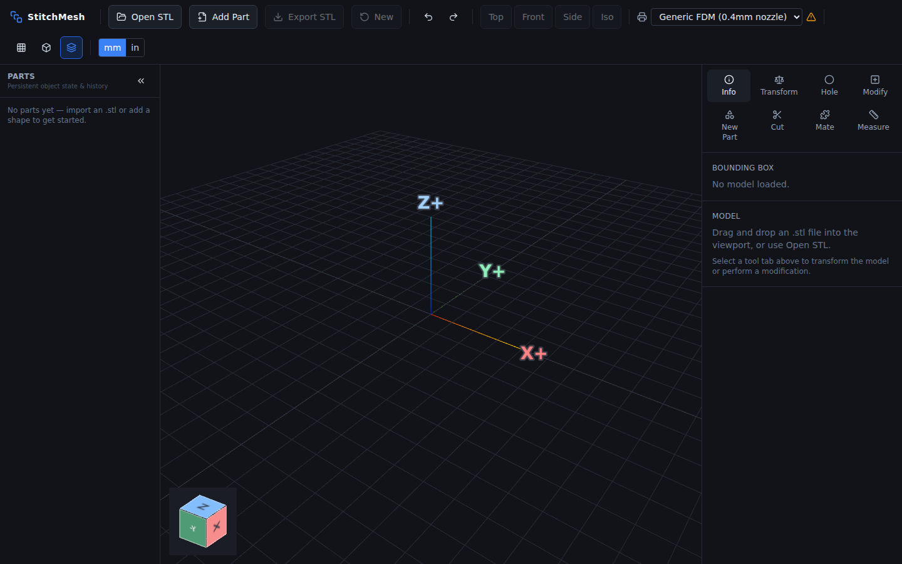

*Empty state: toolbar across the top, empty dark viewport with a grid and
axes gizmo, sidebar on the right defaulted to the **Info** tab reporting
"No model loaded."*

It ships in three forms, all built from the same source:

| Build | Command | What you get |
|---|---|---|
| Desktop app | `npm run dev` (dev) / `npm run build` (packaged) | Electron app with native Open/Save file dialogs |
| Web bundle | `npm run build:web` | Multi-file `dist/` folder; needs a static server |
| **Standalone** | `npm run build:standalone` | **One `dist-standalone/index.html` file** — double-click it, works fully offline, no install, no server. Import/export fall back to drag-and-drop and browser downloads. |

All screenshots in this manual were captured from the standalone build
running in a real (non-Electron) browser, offline.

---

## 2. Loading and exporting a model

**Import** — either drag an `.stl` file onto the viewport, or click **Open
STL** in the toolbar (desktop: native file picker; standalone: browser file
picker). The file is read into memory only — the original file on disk is
never modified.

**Export** — click **Export STL** in the toolbar. Desktop: native Save As
dialog. Standalone: a normal browser download, named
`<original-name>-modified.stl`. Export always writes a *new* file; your
source `.stl` is untouched either way.

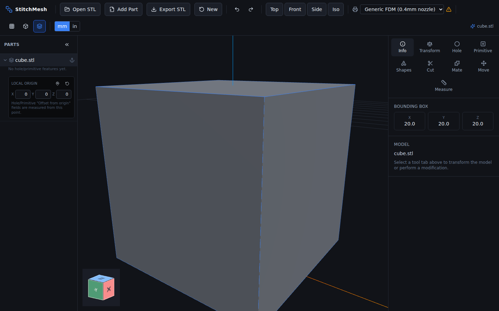

*After import: the model renders in the viewport, the sidebar's Info tab
shows the file name, and the **Bounding Box** readout (visible on every
tab) reports live X × Y × Z dimensions in millimeters.*

**Printer-not-selected export gate**: the first time you click Export STL
without having picked a printer profile (see §9), a confirmation dialog
interrupts: *"No printer selected yet... Click OK to export anyway with
Generic, or Cancel to pick your printer first."* Accepting confirms Generic
and this won't ask again; Cancel backs out so you can pick one.

---

## 3. Viewport navigation

- **Orbit**: left-click-drag, or **middle-click-drag**.
- **Pan**: right-click-drag.
- **Zoom**: scroll wheel.
- **Middle-click-drag re-centers on whatever's under the cursor** at the
  moment you press the button (raycast against the model), rather than
  orbiting around a fixed point — click near a corner and drag, and the
  view pivots around that corner instead of the model's center. Left-drag
  still orbits around the same shared pivot.
- **View presets** (toolbar): **Top / Front / Side / Iso** jump the camera
  to a standard orthographic-ish framing of the current model.

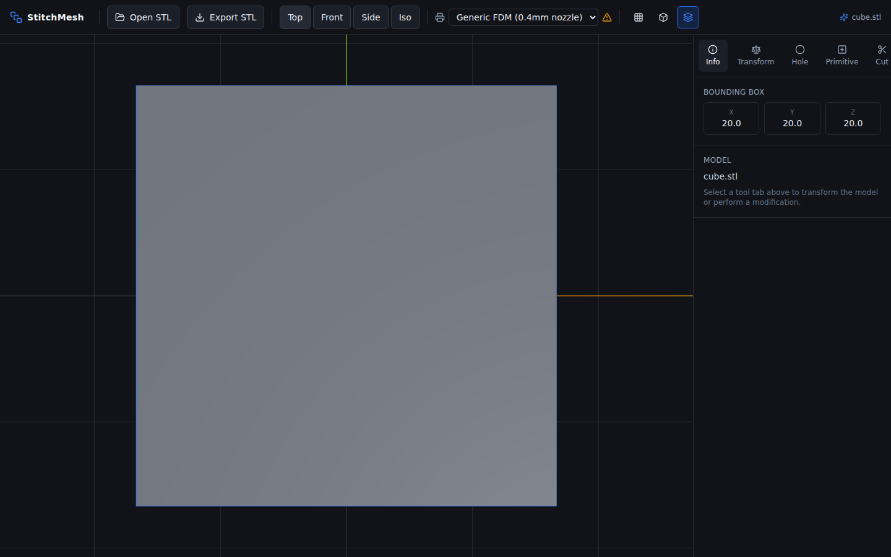 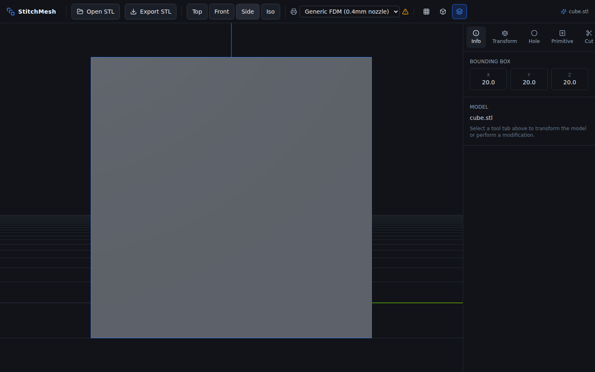

*Left: **Top** preset. Right: **Side** preset. Both re-frame and re-target
the camera to the model's current bounding box, so they still work
sensibly after scaling, rotating, or cutting.*

**Display toggles** (toolbar, right of the view presets — three icon
buttons):

| Icon | Toggle | Effect |
|---|---|---|
| Grid | Wireframe | Renders the model as an edge mesh instead of solid |
| Cube | Flat shading | Switches from smooth (interpolated) to faceted shading — useful for inspecting a mesh's actual triangle density |
| Layers | Bounding box | Shows/hides the blue box outline around the model (on by default) |

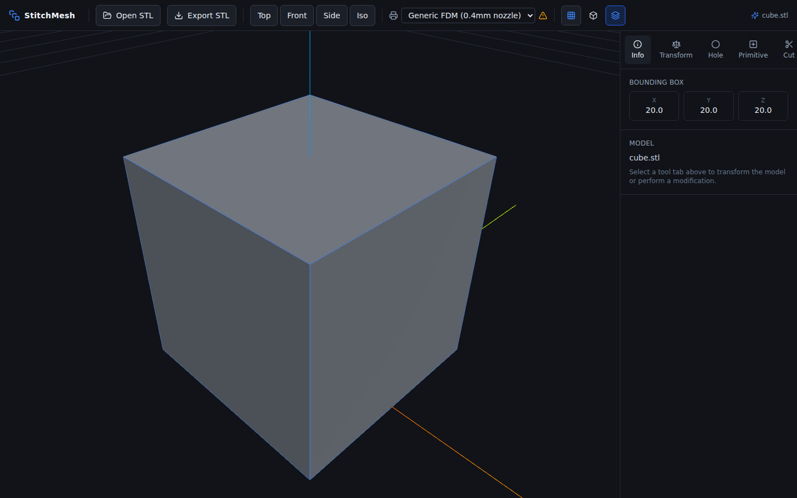 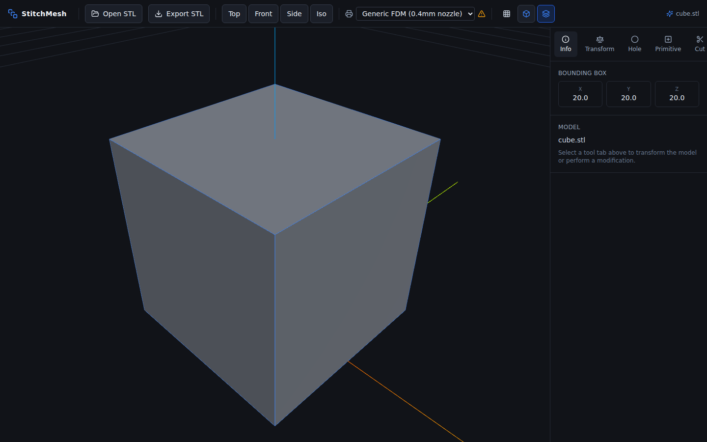

*Left: wireframe on. Right: flat shading on (each triangle facet visibly
distinct — this is what a coarse or low-poly mesh looks like).*

---

## 4. Transform tool

Tab: **Transform**. Affects the whole model.

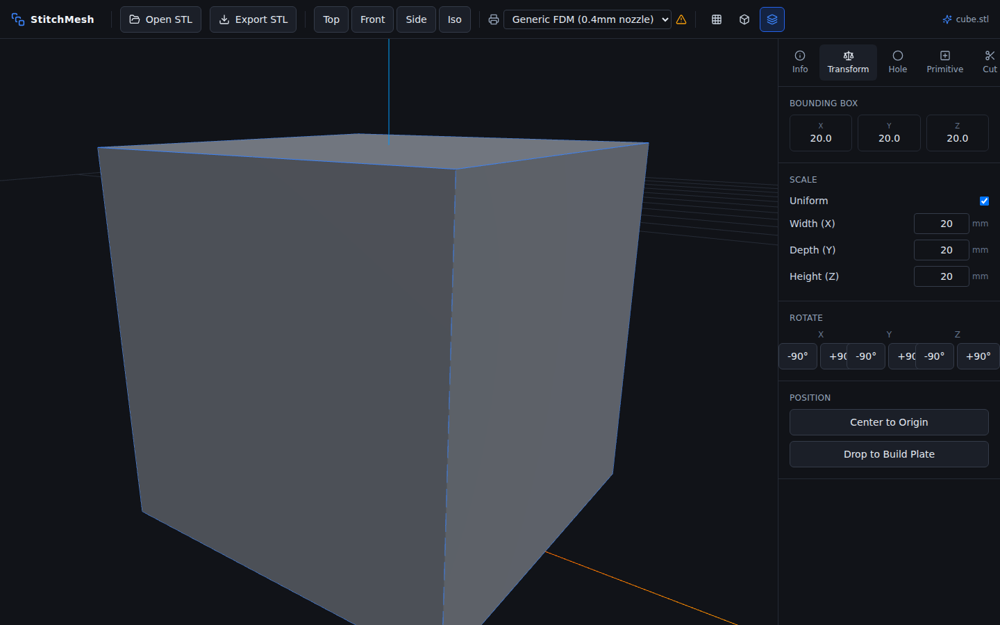

- **Scale** — X/Y/Z fields show the model's *current* size in mm; typing a
  new value rescales to that exact size. The **Uniform** checkbox (on by
  default) keeps all three axes proportional when you edit one field; turn
  it off to stretch a single axis independently.
- **Rotate** — six buttons, ±90° snaps around each of X/Y/Z. No free-angle
  rotation input currently exists (see §12).
- **Center to Origin** — recenters the model's bounding box at world
  (0,0,0) on all three axes.
- **Drop to Build Plate** — shifts the model in Z only so its lowest point
  sits exactly at Z=0, without moving X/Y. This runs automatically once on
  import too.

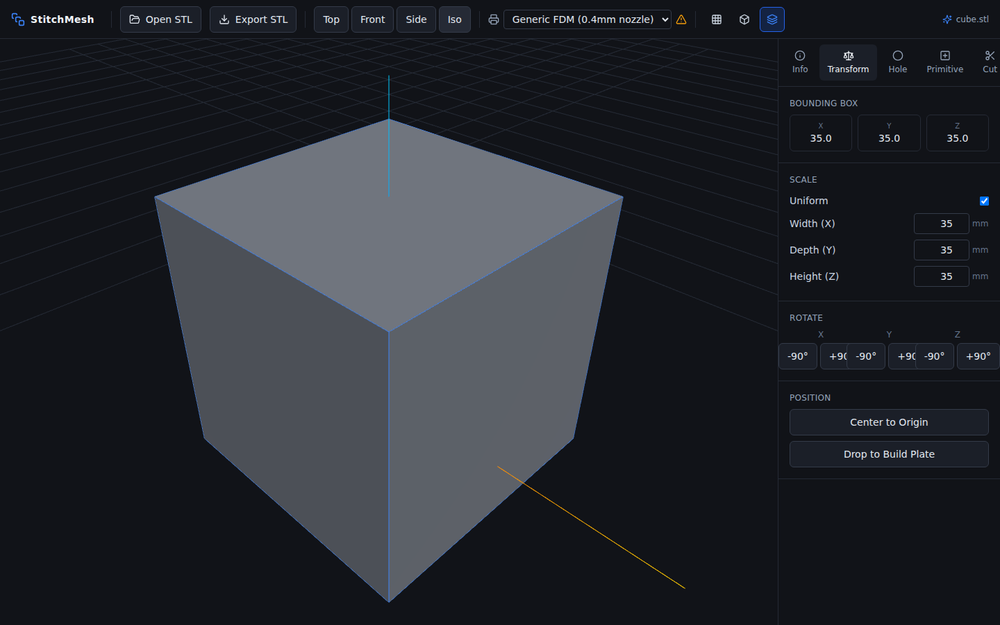

*The 20mm test cube after typing 35 into the Width field with Uniform
scaling on — X/Y/Z all grew proportionally to 35mm.*

---

## 5. Hole Modifier

Tab: **Hole**. Cuts a cylindrical (or threaded) hole into the model at a
point you click.

**Workflow**: click **Hole** → click a point on the model's surface → the
sidebar now shows Diameter, Depth, and (once a size is chosen) Thread
fields, plus **Apply Boolean Subtract** / **Cancel**.

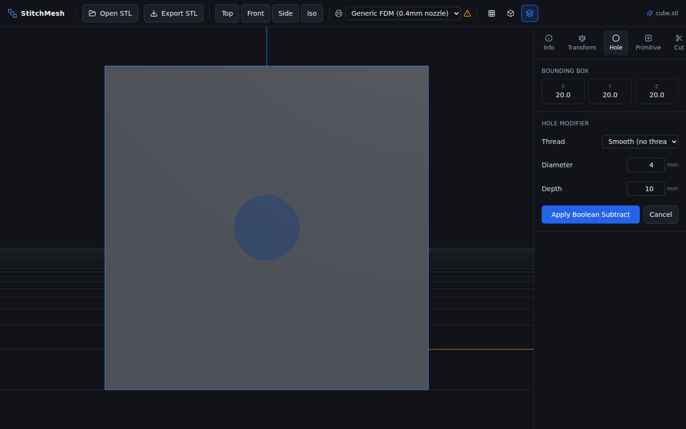

*A cutter (translucent blue cylinder) placed on the front face after one
click. It's oriented to the surface normal automatically — no manual
aiming needed.*

- **Diameter** / **Depth** (mm) — free-typed when **Thread** is set to
  "Smooth (no thread)".
- **Thread** — a dropdown of standard hardware sizes (§8). Picking one
  locks Diameter to that thread's exact major diameter (shown grayed out)
  and switches the cutter from a smooth cylinder to a real helical
  thread profile.

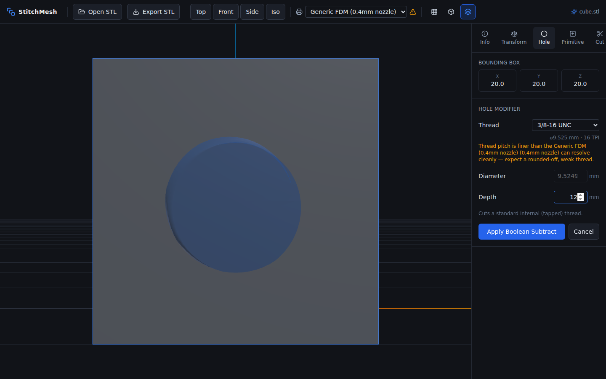

*3/8-16 UNC selected: Diameter now reads the thread's major diameter
(9.525mm) and is locked; a caption confirms "Cuts a standard internal
(tapped) thread."*

**Depth means depth**: the full stated Depth is what actually gets removed
from the material — a "Depth: 10mm" hole removes 10mm, not 5mm (this was a
real bug caught and fixed during this review; see §11).

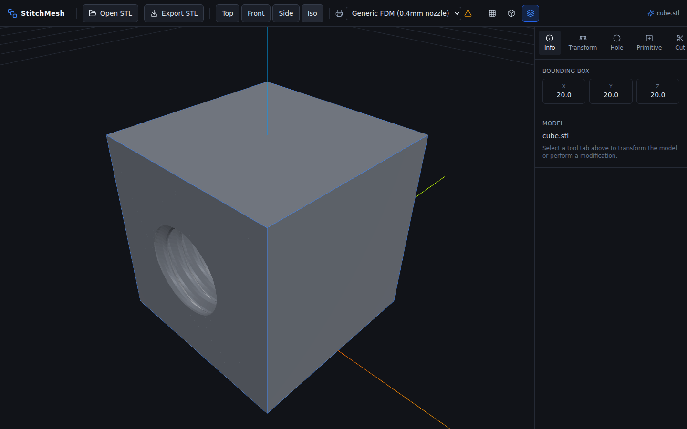

*Result: a visible internal thread spiraling down the bore, cut by
subtracting the exact same helical geometry a real tap would leave behind.*

---

## 6. Primitive Add/Subtract

Tab: **Primitive**. Places a block, cylinder, or washer and unions
(adds) or subtracts it from the model at a clicked point.

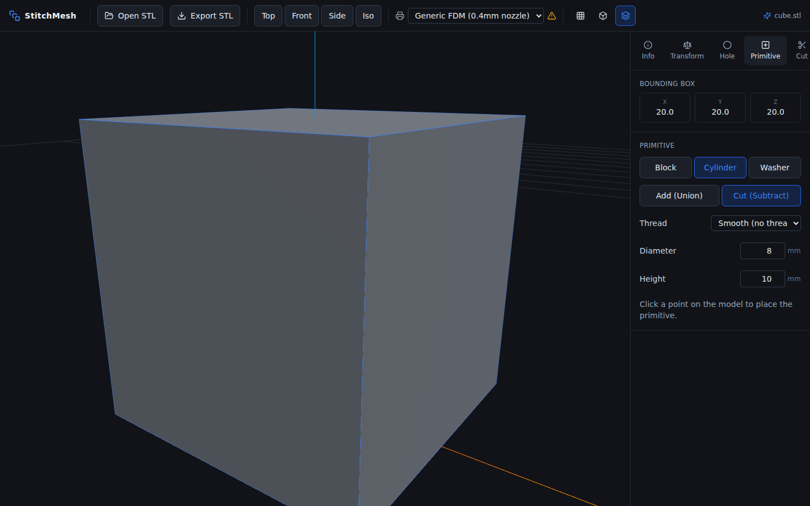

- **Shape**: Block / Cylinder / Washer.
- **Operation**: **Add (Union)** fuses the primitive onto the model as a
  new protrusion; **Cut (Subtract)** carves it out as a cavity.
- **Dimensions**: Block gets Width/Depth/Height; Cylinder gets
  Diameter/Height; Washer gets Outer Diameter/Inner Diameter/Height.
- **Thread** (Cylinder shape only): same dropdown as the Hole tool. With
  **Add (Union)** it becomes an external thread (a printed boss/stud);
  with **Cut (Subtract)** it becomes an internal thread (a tapped hole) —
  the panel's caption updates to say which.

Click a point on the model to place the primitive (same click-to-place
flow as the Hole tool), adjust dimensions, then **Apply**.

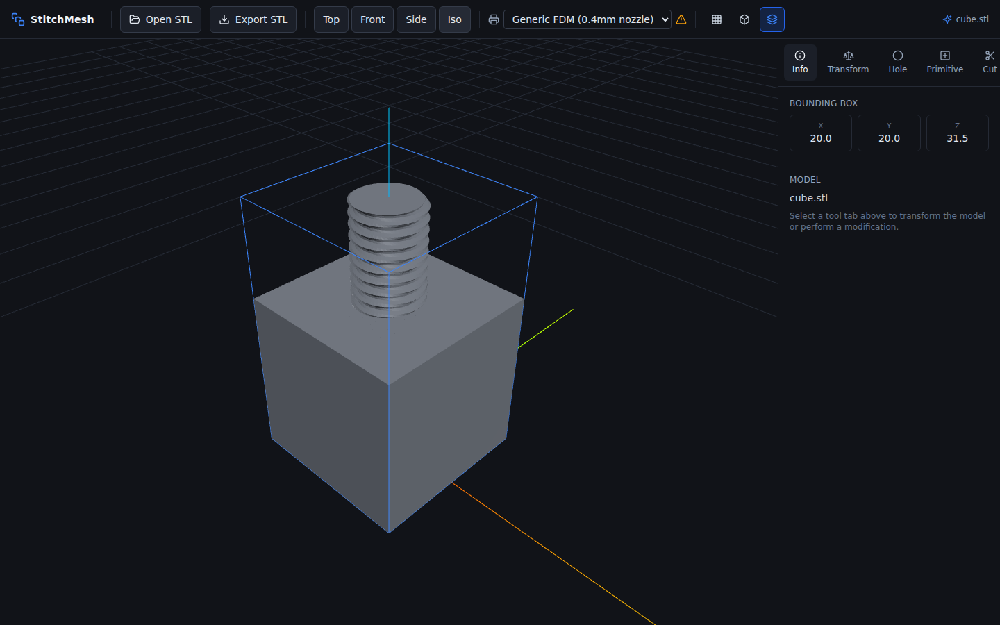

*M8×1.25, Add (Union), 12mm tall, placed on the top face: a real threaded
stud protruding from the surface. Bounding-box Z grew from 20.0 to 31.5mm —
essentially the full 12mm height (minus a deliberate ~0.5mm embed fused
into the surface for a clean, non-degenerate boolean).*

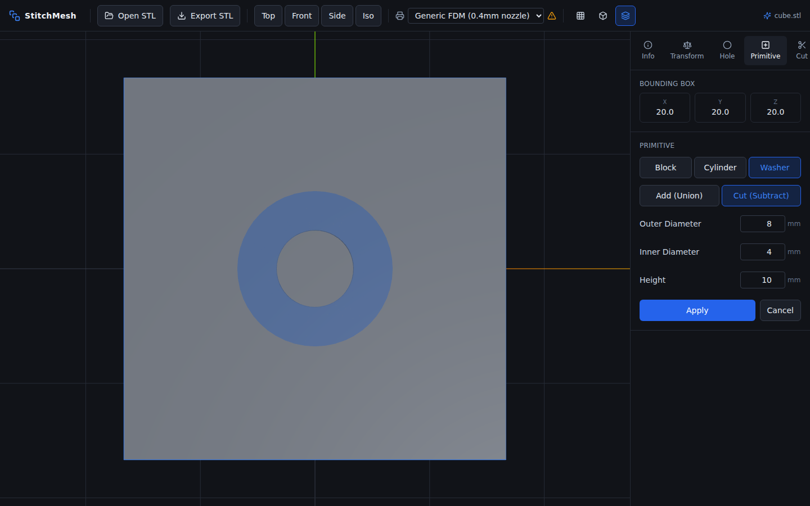

*Washer shape selected and placed: outer/inner diameter and height fields,
with Apply/Cancel once a point is clicked.*

---

## 7. Plane Cut

Tab: **Cut**. Splits the whole model into two separate solids along an
axis-aligned plane.

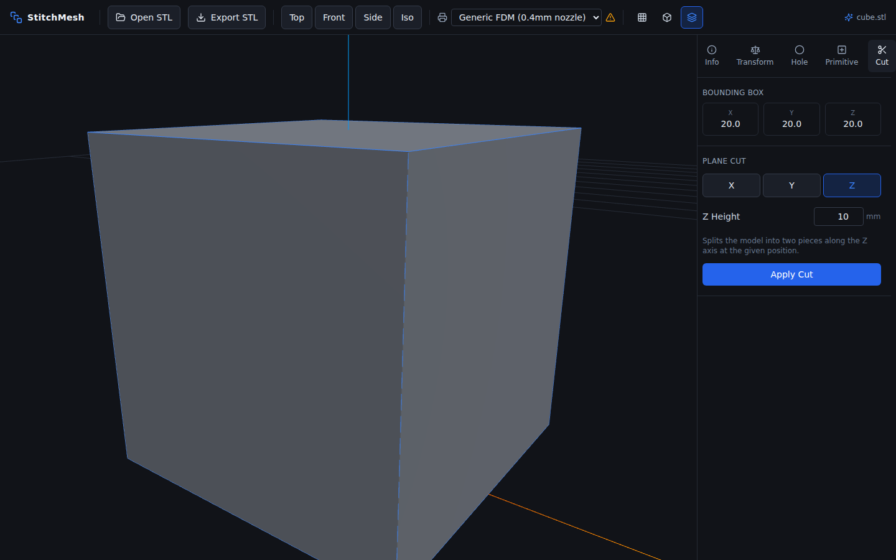

- **Axis** — X / Y / Z, which axis the cutting plane's normal points along.
- **Height** — the plane's position along that axis. This now
  auto-defaults to the model's actual center on the selected axis whenever
  you open the tool or change axis (fixed during this review — the old
  static default of 0 was a silent no-op for any model sitting on the
  build plate; see §11).
- **Apply Cut** — both resulting pieces are kept and exported together.


*After cutting: two separate solids exist, but they sit exactly where the
original model did with no visual gap between them — see §12, this is a
known rough edge worth a follow-up ("Move" tool or an auto-separation
offset) rather than something fixed in this pass.*

---

## 8. Thread generator & standard sizes

Both the Hole and Primitive (cylinder) tools share one **Thread** dropdown
with three groups:

- **Metric (ISO)**: M2, M2.5, M3, M4, M5, M6, M8, M10, M12, M14, M16, M18, M20 (coarse pitch)
- **Unified Coarse (UNC)**: #4-40, #6-32, #8-32, #10-24, 1/4-20, 5/16-18, 3/8-16, 7/16-14, 1/2-13, 5/8-11, 3/4-10
- **Unified Fine (UNF)**: #4-48, #6-40, #8-36, #10-32, 1/4-28, 5/16-24, 3/8-24, 7/16-20, 1/2-20, 5/8-18, 3/4-16

Picking a size doesn't just set the diameter — it generates an actual
helical 60° V-thread mesh, built from the same fundamental-triangle
geometry both standards share (ISO 68-1 for metric, ASME B1.1 for Unified):

```
H (fundamental triangle height) = 0.866025 × pitch
pitch diameter                  = major diameter − 0.649519 × pitch
minor diameter                  = major diameter − 1.082532 × pitch
crest truncated by H/8, root truncated by H/4
```

These constants were cross-checked against known published table values
(M6×1.0 → minor diameter 4.917mm; M10×1.5 → pitch diameter 9.026mm) — both
matched exactly.

An internal (tapped) thread and an external (screw) thread are the *same*
nominal profile geometrically — the generator is reused as a subtraction
cutter for one and a union addition for the other, exactly like a real tap
cuts the mating shape of the bolt it's sized for.

---

## 9. Printer profiles

The toolbar's **Printer** dropdown (next to the printer icon) holds specs
for common machines and tunes every threaded feature to match:

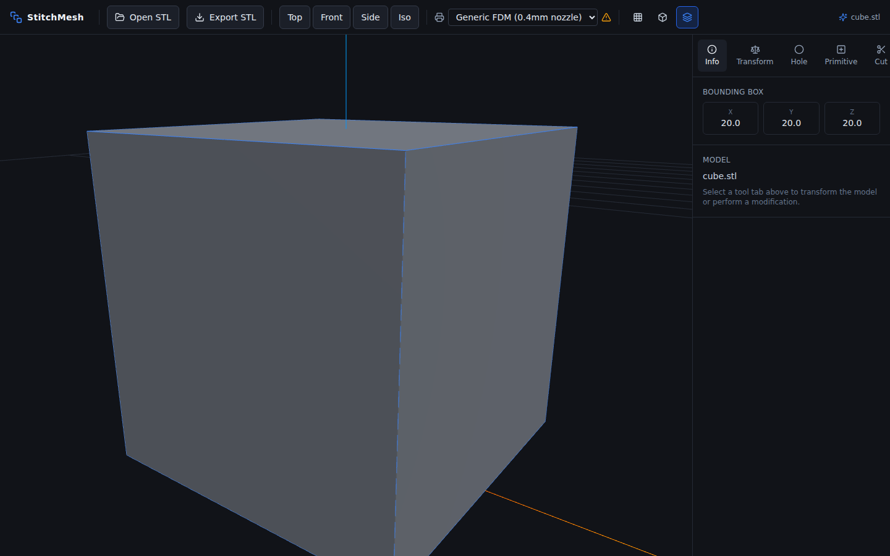

*Default state: "Generic FDM (0.4mm nozzle)" with a warning triangle —
shown whenever Generic is active, confirmed or not, since the underlying
concern (no machine-specific tuning) is still true either way.*

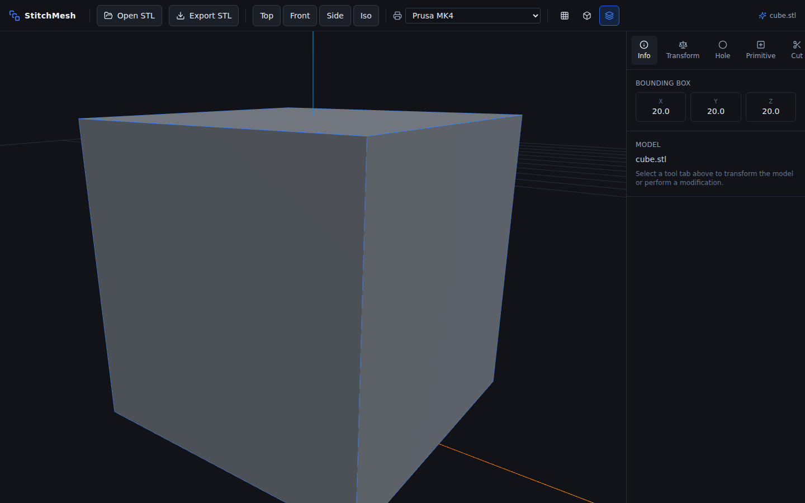

*After picking "Prusa MK4": the warning icon clears.*

What the profile actually changes:

- **Mesh resolution** — radial facet count and helical height-ring count
  are computed from the printer's nozzle/spot diameter and typical layer
  height, so the thread mesh isn't finer than the machine can reproduce
  (wasted triangles) or coarser than it needs to be (visibly faceted).
- **Internal-thread clearance** — a small diametral clearance is added to
  tapped holes (0.25–0.35mm for FDM depending on machine, 0.1mm for resin)
  so a print actually accepts a real bolt despite typical over-extrusion.
- **Printability warning** — appears directly under the Thread dropdown in
  the Hole/Primitive panel when a chosen pitch is finer than the selected
  nozzle can resolve, or the size is small enough (below roughly M4/#8)
  that a threaded insert would print more reliably than the thread itself.

Included profiles: Generic FDM, Bambu Lab X1 Carbon, Bambu Lab P1S, Prusa
MK4, Creality Ender 3 V2, Creality K1C, Voron 2.4 (350mm), Ultimaker S5,
Elegoo Saturn 3 (resin), Formlabs Form 4 (resin).

---

## 10. Every control, at a glance

| Location | Control | Does |
|---|---|---|
| Toolbar | Open STL | Import an `.stl` (drag-and-drop also works anywhere on the viewport) |
| Toolbar | Export STL | Save the current model as a new `.stl` |
| Toolbar | Top / Front / Side / Iso | Jump to a preset camera framing |
| Toolbar | Printer dropdown | Select target printer; tunes thread resolution/clearance |
| Toolbar | Wireframe / Flat shading / Bounding box | Display toggles |
| Sidebar → Info | (read-only) | File name, bounding box |
| Sidebar → Transform | Scale X/Y/Z, Uniform | Resize the model |
| Sidebar → Transform | Rotate ±90° (×3 axes) | Snap-rotate the model |
| Sidebar → Transform | Center to Origin | Center bounding box at (0,0,0) |
| Sidebar → Transform | Drop to Build Plate | Z-align lowest point to 0 |
| Sidebar → Hole | Diameter, Depth, Thread | Configure a hole cutter after clicking a point |
| Sidebar → Hole | Apply Boolean Subtract / Cancel | Commit or discard the hole |
| Sidebar → Primitive | Shape, Operation, dimensions, Thread | Configure a primitive after clicking a point |
| Sidebar → Primitive | Apply / Cancel | Commit or discard the primitive |
| Sidebar → Cut | Axis, Height, Apply Cut | Split the model in two |
| Viewport | Left/middle-drag, right-drag, scroll | Orbit, pan, zoom |

---

## 11. Accuracy & validity review

A full-codebase review (an automated correctness pass plus manual
re-derivation of the placement math) was run against everything built in
this project. Two real, user-facing bugs were found and are **already
fixed** as of this manual:

1. **Hole/Primitive depth was silently halved.** The cutter mesh is built
   centered on its own axis; positioning its center exactly on the clicked
   surface point meant only half of any stated Depth/Height actually did
   anything — the other half was wasted straddling the surface in open
   air. Fixed by shifting the cutter along the surface normal so the full
   stated length lands on the correct side (into the material for a cut,
   outward for an addition), confirmed by drilling a 25mm-deep hole
   through a 20mm-thick test block and verifying it broke through the far
   face.
2. **Plane Cut's default height (0) was a silent no-op.** Models load
   sitting on the build plate (Z starts at 0, not centered), so cutting Z
   at height 0 sliced exactly at the bottom face and removed nothing on
   first try. Fixed to auto-default to the model's actual center on
   whichever axis is selected.

Two smaller code-quality findings (a duplicated "generic printer" id
string across three files, and a stale README line contradicting the
Generic-warning-icon's actual intended behavior) were also fixed.

**Everything below was re-verified after both fixes**, in a real (non-
Electron) browser, offline, with zero console errors in every case:

- STL import via drag-and-drop
- Smooth and threaded Hole Modifier, including a through-hole test
- Primitive Add (union boss) and Subtract (washer), smooth and threaded
- Plane Cut (now producing a real, non-degenerate split)
- Scale/rotate/center/drop transforms, including CSG ops performed *after*
  a scale or rotation (the coordinate-space bug this exposed — using local
  instead of world transforms — was caught and fixed earlier in this
  project; still holds)
- Printer profile selection, the Generic warning icon, and the
  export-time confirmation gate
- Middle-click-drag re-targeted orbit
- STL export as a valid, correctly-sized binary file

**Known limitations** (not bugs, but worth knowing):

- **Thread mesh triangle counts scale up fast.** A fine-pitch thread over
  a long depth can generate 10,000+ triangles (e.g. M8×1.25 through a
  20mm-deep hole was ~13,000). Not incorrect, just heavier than a
  hobbyist might expect from "add a thread."
- **Raycast normals are winding-derived, not repaired.** If an imported
  STL has inverted/inconsistent face winding (a real, if uncommon, defect
  some STL files have), the Hole/Primitive click-to-place direction logic
  would be wrong for that face specifically. StitchMesh doesn't currently
  detect or repair this — see the suggested "mesh validation" feature
  below.
- **Plane Cut pieces aren't visually separated.** Both halves stay
  exactly where the original model was; there's no way to drag them apart
  within the app, so a cut can look like nothing happened until you
  inspect dimensions or export.
- **No free-angle rotation.** Only ±90° snaps exist; there's no numeric
  degree input for an arbitrary rotation.
- **Single object only.** StitchMesh holds one model at a time — no
  importing a second part into the same scene, no assembling multiple
  pieces before export.

---

## 12. Suggested additional features (not yet built — for your review)

Researched against what beginner-friendly tools in this space (Tinkercad,
3D Builder, and general-purpose STL repair tools) treat as baseline, cross-
referenced against the limitations found above. None of these are built —
this is a menu, not a plan, pending your go-ahead:

1. **Undo/redo (Ctrl+Z / Ctrl+Y).** Probably the single highest-value gap:
   every other tool in this class has it, and StitchMesh currently has no
   way to walk back a bad cut short of reloading the original file.
2. **Mesh validation / auto-repair on import.** Detect non-manifold edges,
   holes, or inverted normals in an imported STL and offer a one-click
   fix — directly closes the "winding-derived normals" limitation above,
   and is one of the most commonly requested features in this space.
3. **Free-angle rotation input** alongside the existing ±90° snaps.
4. **A "Move" tool** to reposition pieces after a Plane Cut (or a
   primitive placed slightly off) — would also resolve the "cut pieces
   overlap invisibly" limitation.
5. **Snap-to-grid** for placement/transforms, off by default.
6. **A measurement tool** — click two points, read the distance — useful
   in a hardware-fitting-focused tool like this one for checking clearances
   before committing to a hole/thread size.
7. **Keyboard shortcuts** for the view presets and common actions (Tinkercad-style: number keys for views, Delete to reset, etc.).
8. **A "New/Reset" toolbar action** to clear the current model without a
   full page reload.
9. **Mirror tool** — flip the model across an axis.
10. **Multiple objects in one scene** — import a second part, position it
    relative to the first, export together (useful for test-fitting a
    printed part against, say, a washer or bracket modeled separately).

---

*Screenshots in this manual live in `docs/manual-assets/` alongside this
file, captured from the standalone build (`dist-standalone/index.html`) at
1440×900 in a real headless Chromium instance, offline.*
