# StitchMesh — Complete User Manual

> **Release update: Parts-first workflow** — this edition documents the persistent Parts command center, visibility controls, part locking, context actions, feature visibility/naming, and the combined Transform/Move workspace.

*"Modify, don't model."* StitchMesh is an offline tool for making localized
edits to an existing `.stl` file — resize a hole, add a threaded boss, mate
and weld two parts together, cut a model in two and move the pieces apart,
measure a clearance — without learning a full CAD package.

This manual walks through every feature with screenshots so you can find
what you need quickly.

---

## 1. What StitchMesh is

A four-panel app: a **toolbar** across the top (file, undo/redo, view,
units, printer, display toggles), a collapsible **Parts panel** on the
left listing every object in the scene as its own layer, a **3D viewport**
filling the center, and a **context sidebar** on the right with nine tool
tabs whose contents change based on which is active: **Info, Transform,
Hole, Primitive, Shapes, Cut, Mate, Move, Measure**.


*Empty state. Toolbar across the top (Open STL, Add Part, Export STL, New,
Undo/Redo, view presets, unit toggle, printer picker, display toggles).
Parts panel on the left, empty. Dark viewport with a grid, an axes gizmo,
and the orientation cube in the bottom-left corner. Sidebar defaulted to
Info, reporting "No model loaded."*

StitchMesh is a single self-contained HTML file. Double-click it to open it
in your browser and it works fully offline — no install, no server, and
nothing is ever sent over the internet. Importing reads your `.stl` file
straight into memory, and exporting saves a new file through your
browser's normal download flow, so your source file is never modified.

---

## 2. Loading, adding, exporting, and resetting a model

- **Import**: drag an `.stl` onto the viewport, or click **Open STL** to
  pick a file. This *replaces* everything currently in the scene. Reading
  a file never modifies it on disk.
- **Add Part**: imports another `.stl` as a second, independent object
  next to the first, rather than replacing it — see §5 (Parts Panel). The
  **Shapes** tab (§9) does the same thing for basic solids instead of an
  imported file. If nothing is loaded yet, Add Part behaves exactly like
  Open STL.
- **New**: clears the current model (and its undo history). Asks for
  confirmation first if a model is loaded.
- **Export STL**: saves the current scene — every part in it — as a new
  file, downloaded as `<original-name>-modified.stl`. Your source file is
  never overwritten.

**Printer-not-selected export gate**: the first time you click Export STL
without having picked a printer profile (§18), a dialog interrupts:
*"No printer selected yet... Click OK to export anyway with Generic, or
Cancel to pick your printer first."* Accepting confirms Generic so it
won't ask again.


*After import: the model renders, the part appears in the Parts panel on
the left, and the Bounding Box readout (visible on every tab) reports the
**selected part's** live X × Y × Z dimensions.*

---

## 3. Viewport navigation

- **Orbit**: **middle-click-drag only.** It re-centers on whatever's under
  the cursor the moment you press the button, rather than orbiting around
  a fixed point — click near a corner and drag, and the view pivots
  around that corner.
- **Pan**: right-click-drag.
- **Zoom**: scroll wheel.
- **Left-click** is deliberately *not* an orbit control — it's reserved
  for tool actions (Hole, Primitive, Mate, Measure, picking a local
  origin) and for directly dragging a part that's **locked to the build
  plate** across it (§5, §12). Left-clicking empty space or an unlocked
  part does nothing.
- **View presets** (toolbar): **Top / Front / Side / Iso**, or press
  **1 / 2 / 3 / 4** on the keyboard.


*Top preset. Presets re-frame and re-target the camera to the whole
scene's **current** bounding box, so they stay useful after scaling,
moving parts apart, or cutting.*

**Orientation cube**: the small cube in the viewport's bottom-left corner
always shows the current view orientation, rotating in sync with the main
view — turn the model and the cube turns with it. Each face is labeled:
the bright **X** / **Y** / **Z** faces point along the positive axis, the
matching darker **-X** / **-Y** / **-Z** faces point the other way.

**World axis lines**: three colored reference lines run from the build
plate's origin — red for X, green for Y, blue for Z — and each one is
labeled **X+**, **Y+**, or **Z+** right at its tip, so you can read the
scene's orientation directly off the lines themselves, not just the
corner cube. The label always faces the camera and stays legible even
when a part sits in front of it.


*Each axis line ends in a colored, always-camera-facing "+" label —
X/Y/Z orientation is readable at a glance from anywhere in the scene.*

**Display toggles** (toolbar icons, or keyboard **W** / **B**):

| Icon / key | Toggle | Effect |
|---|---|---|
| Grid icon / `W` | Wireframe | Renders the model as an edge mesh |
| Cube icon | Flat shading | Faceted instead of smooth shading — shows actual triangle density |
| Layers icon / `B` | Bounding box | Shows/hides the blue outline around the **selected part** (on by default) |

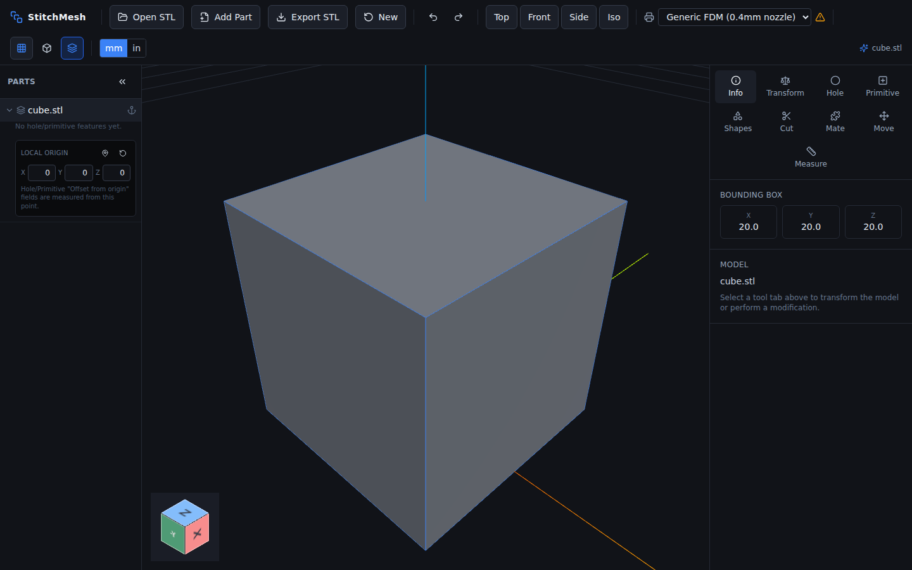

*Wireframe on, from the Iso preset. The orientation cube sits in the
bottom-left corner throughout.*

### Keyboard shortcuts reference

| Key | Action |
|---|---|
| `Ctrl`/`Cmd` + `Z` | Undo |
| `Ctrl`/`Cmd` + `Y`, or `Ctrl`/`Cmd` + `Shift` + `Z` | Redo |
| `1` `2` `3` `4` | Top / Front / Side / Iso |
| `W` | Toggle wireframe |
| `B` | Toggle bounding box |

Shortcuts are suppressed while typing in any text field or dropdown.

---

## 4. Units — millimeters or inches

The **mm / in** toggle in the toolbar switches every length field in the
app — Bounding Box, Scale, Position, Diameter/Depth, Local Origin,
Offset-from-origin, and Measure — between millimeters and inches.

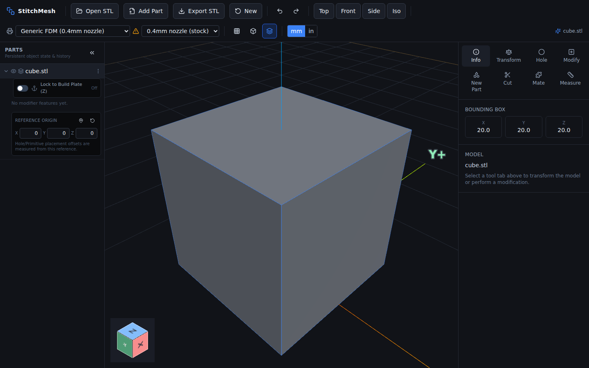


*The same 20mm cube: Bounding Box reads 20.0mm in the left shot, 0.787in
in the right after switching units. Nothing about the model itself
changes — StitchMesh always stores geometry in millimeters internally;
the toggle only changes how numbers are displayed and typed.*

You can type in either unit at any time — switch to inches, type a
diameter in inches, switch back to mm, and the value converts correctly
both ways.

---

## 5. Undo / Redo

Toolbar: the two curved-arrow icons next to New, or `Ctrl+Z` / `Ctrl+Y`.
Every committed change is undoable: Hole/Primitive/Plane Cut/Mate/Weld
apply, feature edits and deletes, Transform actions (scale, rotate,
center, drop, mirror), Move (including a drag), adding a part or shape,
and mesh repair. Continuous edits (typing digits into a field, or a drag)
are coalesced into a single undo step per edit session rather than one
step per keystroke/frame; discrete actions (a button click) are always
their own step.

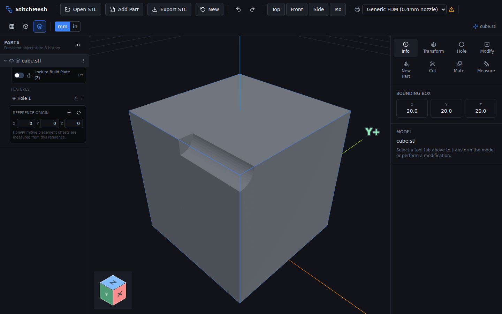 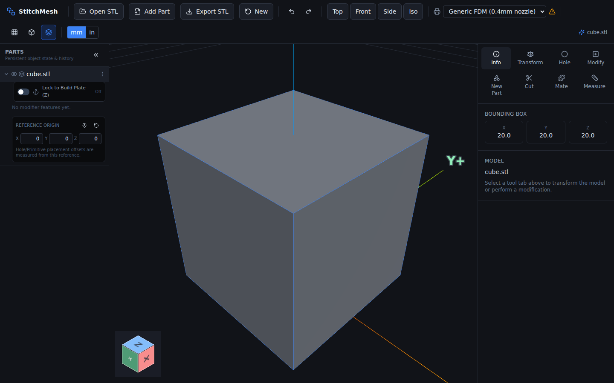

*Left: a hole applied. Right: immediately after `Ctrl+Z` — back to the
unmodified cube. Redo (button or `Ctrl+Y`) reapplies it.*

---

## 6. Parts panel: layers, features, local origin, and lock to plate

The **Parts** panel on the left lists every object currently in the scene
— the first import and anything added afterward — as its own **layer**,
collapsible via the `«` button in its header.

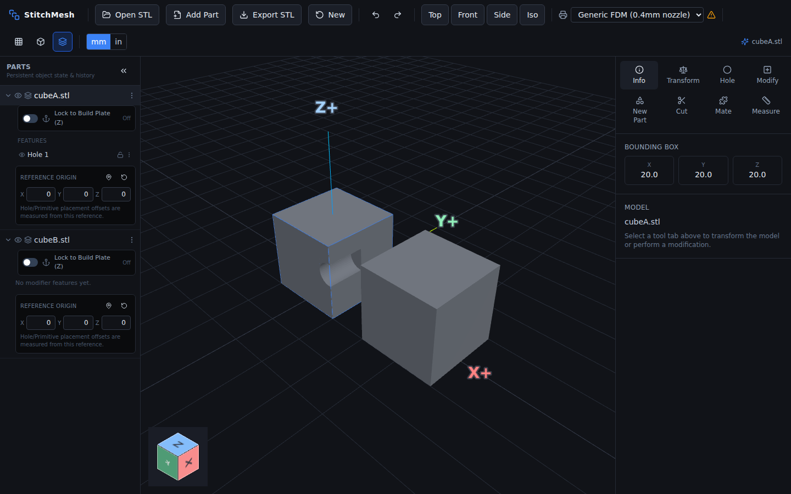

*Two independent parts. Each part has a dedicated **Lock to Build Plate (Z)**
toggle directly beneath its name. Feature controls remain nested under the
part, and each part also carries its own Reference Origin editor.*

**Each part is fully independent** — selecting a part (click its row, or
use the **Part** dropdown on the Move/Cut tabs) makes it the target for
Transform, Move, Mirror, and Plane Cut; none of those actions touch any
other part.

### Persistent part controls

The Parts panel is now the command center for state that belongs to an object rather than to a temporary tool. Each part row can show:

- **Eye** — show/hide the part without deleting it.
- **Lock to Build Plate (Z)** — the per-part toggle directly beneath the part name. This pins the part to Z=0 while keeping X/Y movement available.
- **Part lock** — freezes direct movement and transformation until unlocked. Feature editing remains available, so you can protect placement without making the model unusable.
- **Actions menu** — rename, duplicate, isolate, show all, lock/unlock, lock/unlock to plate, jump directly to Transform/Hole/Modify, or delete the part.

Right-clicking a part opens the same action menu. Double-clicking a feature name lets you rename it.

### Feature layers

Every Hole and Primitive you apply becomes its own named layer nested
under its part (`Hole 1`, `Add cylinder 1`, `Cut cylinder 2`, …) instead
of being baked in and forgotten:

- **Click a feature's name** to reopen it in the Hole/Primitive panel with
  its exact diameter, depth, thread, and position — change anything and
  click **Save Changes**, or **Delete Feature** to remove it entirely.
- **Eye icon** — temporarily hides/shows the feature. Hidden features are excluded from the live composite while the base mesh remains visible.
- **Lock icon** — freezes a feature (including its thread/diameter) so it
  can't be accidentally changed; click the feature and every field is
  replaced with a locked notice until you unlock it again from the same
  icon.
- **More (…) menu** — edit/focus, rename, hide/show, lock/unlock, or delete the feature.
- **Delete icon** (trash) — removes that one feature immediately (fully
  undoable — `Ctrl+Z` brings it right back).

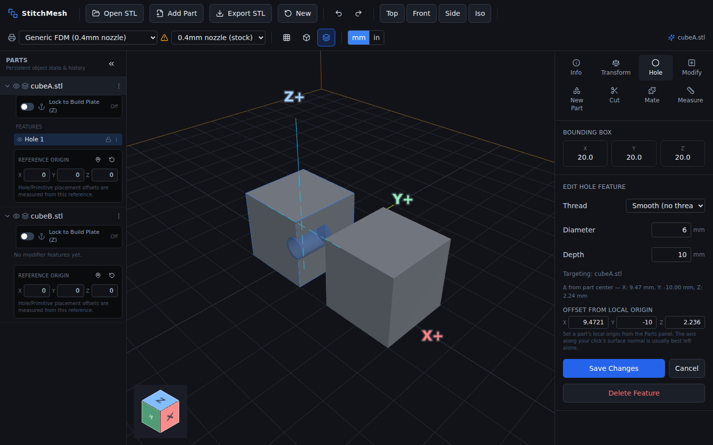

*Clicking **Hole 1** reopens it for editing: the sidebar shows its current
Diameter/Depth/Thread, a Δ-from-center readout, and Offset-from-origin
fields. Two dashed cyan lines mark the part's own center on the two axes
not aligned with the hole's drilling direction, so you can see at a
glance how far off-center it sits.*

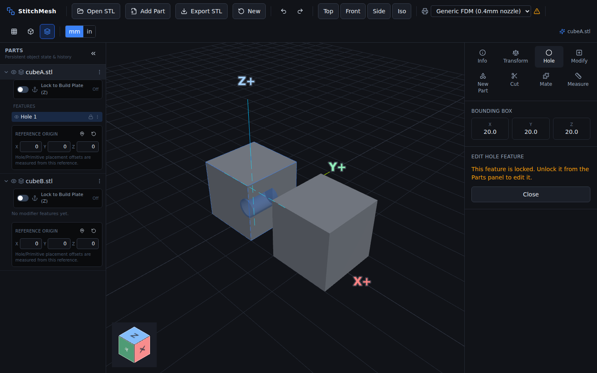

*Reopening a locked feature shows a notice instead of editable fields.
Unlock it from the Parts panel (the same lock icon) to make changes again.*

**One tradeoff worth knowing**: features stay independently editable only
as long as you don't change that part's *scale*. Scaling a part (Transform
→ Scale) permanently folds every existing feature on that part into its
base shape — the holes/bosses stay exactly where they are, just no longer
individually re-editable afterward.

### Local origin

Each part can have its own reference point — independent of world (0,0,0)
— for typing exact Hole/Primitive positions instead of eyeballing a click.
Under a part's feature list:

- **Pin icon** — click, then click a point on that part in the viewport to
  set the origin there (e.g. a corner of a block).
- **Reset icon** — puts the origin back at the part's own center.
- **X / Y / Z fields** — type an exact origin position directly.

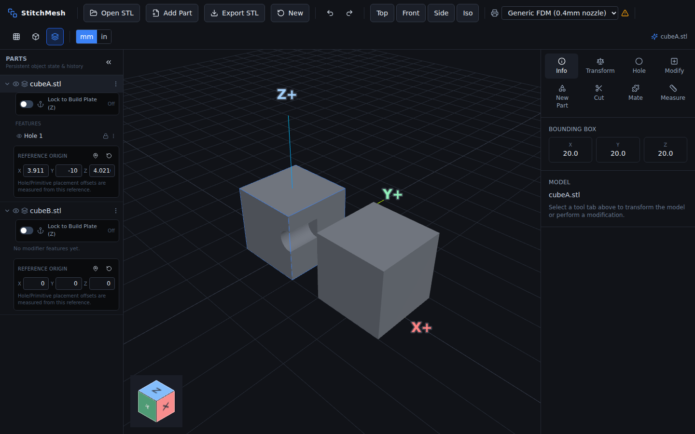

*The origin was picked at a corner of `cubeA.stl`. Placing a feature then
shows **Offset from local origin** X/Y/Z fields — type an exact position
instead of relying on where you clicked.*

This is the tool for the "block with two holes a precise quarter-inch from
each edge" case: set the origin at a bottom corner of the face you care
about, click roughly the right face to establish the drilling direction,
then type the exact X/Y/Z offsets for each hole.

### Lock to plate

The **Lock to Build Plate (Z)** switch directly beneath each part name toggles
**Lock to plate**. Turning it on immediately drops that part to the build plate
(Z=0) and keeps it pinned there afterward:

- The Move tool's Z field and Z-nudge buttons become disabled for that
  part, and its viewport drag gizmo hides its Z handle.
- You can **left-click-drag the part directly in the viewport** — no
  gizmo arrows needed — and it slides across the plate in X/Y only. See
  §12 (Move tool).

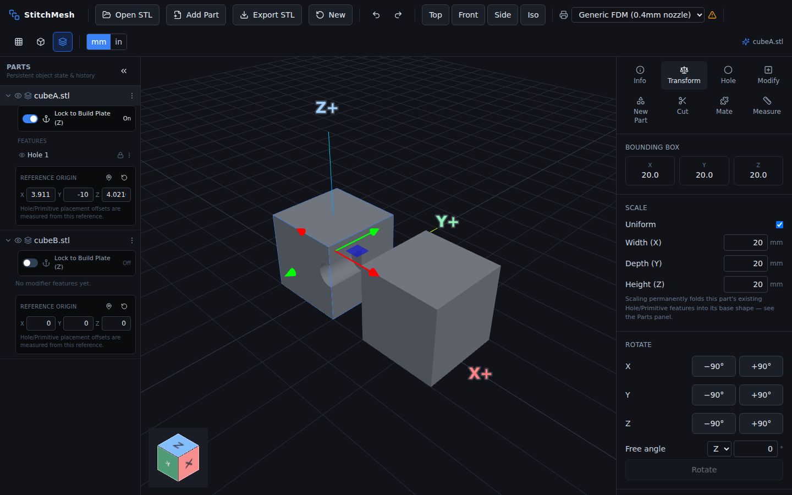

*`cubeA.stl` is locked to plate: the Move panel's Z field is disabled with
an explanatory note, and the drag gizmo on the model shows only the red
(X) and green (Y) arrows — no blue Z arrow.*

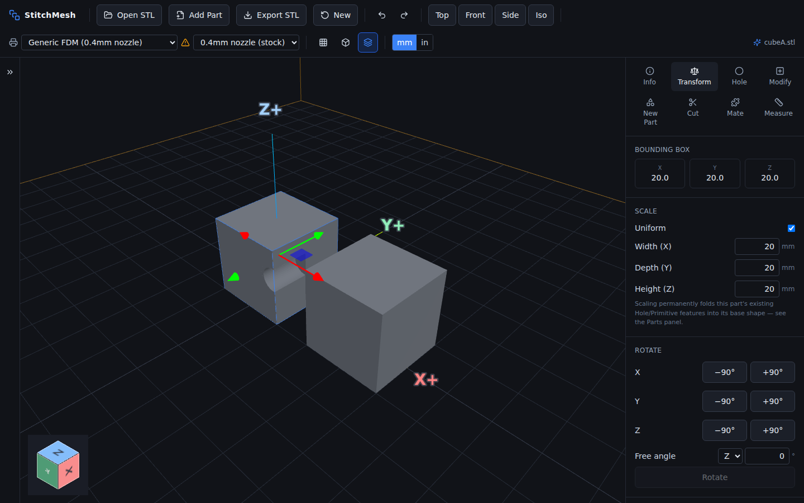

*Collapsed to a thin strip via the `«` button — click the arrow to expand
it again. Purely a display toggle; nothing about the scene changes.*

---

## 7. Transform tool

Tab: **Transform**. Affects only the **selected part** — every other part
in the scene is left alone.

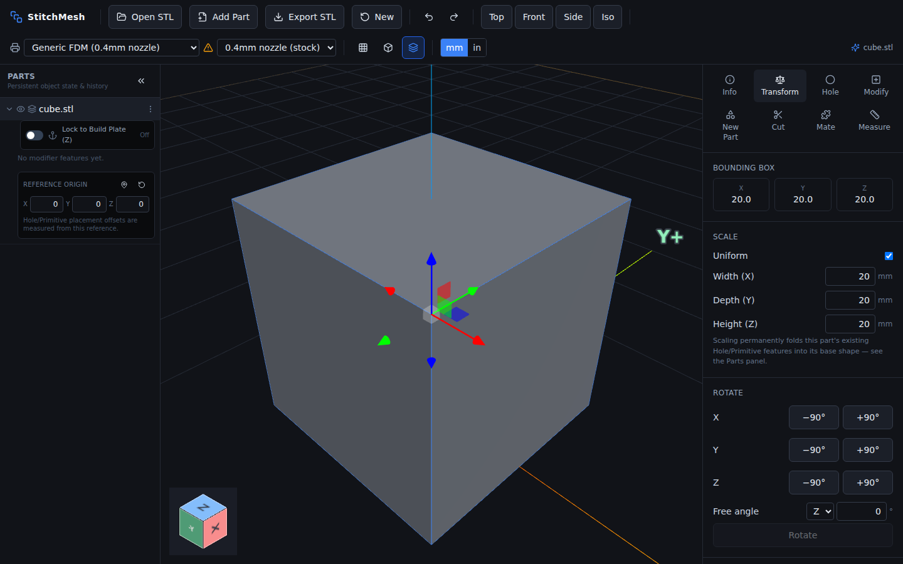

- **Scale** — X/Y/Z fields show the selected part's current size; typing a
  new value rescales it to that exact size. **Uniform** (on by default)
  keeps all three axes proportional when editing one field. See §6 for how
  scaling interacts with that part's existing features. Unlike Rotate,
  scaling does **not** auto-drop the part back to the plate afterward — it
  scales around the part's existing center, so a part that was resting on
  the plate can end up floating above it or dipping below Z=0. Follow a
  scale with **Drop to Build Plate** (below) if that matters for the part
  you're working on.
- **Rotate** — ±90° snap buttons per axis, plus a **free-angle** row:
  pick an axis, type any number of degrees, click **Rotate**. Rotating
  re-drops the part to the build plate afterward.
- **Center to Origin** — recenters that part's bounding box at world
  (0,0,0) on all three axes.
- **Drop to Build Plate** — Z-only: shifts so the part's lowest point sits
  at Z=0. Runs automatically once on import too.
- **Mirror** — flips the part across X, Y, or Z through its own center,
  with corrected winding, so it flips exactly in place and raycasting/
  further edits keep working correctly afterward.

---

## 8. Hole Modifier

Tab: **Hole**. Cuts a cylindrical (or threaded) hole at a point you click.

**Workflow**: click **Hole** → click a point on any part's surface → the
sidebar shows Diameter, Depth, Thread, an offset/center readout, and
**Apply Boolean Subtract** / **Cancel**. The part you clicked becomes the
target automatically — no extra selection step, even with multiple
objects in the scene. The result is saved as its own editable layer under
that part — see §6 to reopen, lock, or delete it later.

- **Diameter** / **Depth** — free-typed when Thread is "Smooth (no
  thread)". **Depth means depth**: the full stated value is removed from
  the material, drilling *into* the surface from the clicked point (not
  split half in/half out).
- **Thread** — a dropdown of standard hardware sizes (§17). Picking one
  locks Diameter to that thread's exact major diameter and cuts a real
  helical thread instead of a smooth cylinder.
- **Δ from part center** / **Offset from local origin** — two reference
  readouts (§6) once the cutter is placed. The offset fields are editable:
  type exact X/Y/Z numbers to nudge the hole precisely instead of
  re-clicking.

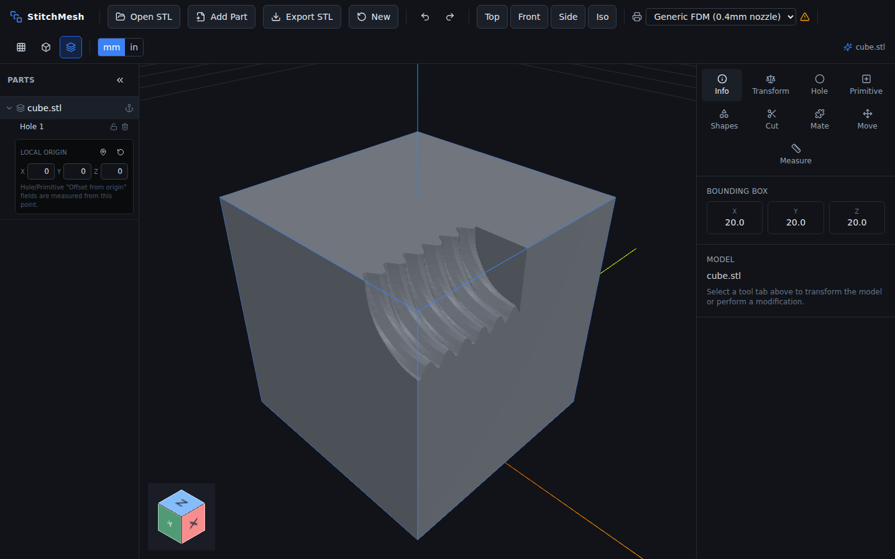

*3/8-16 UNC hole applied: a visible internal thread spiraling down the
bore, generated from the same geometry a real tap would cut.*

---

## 9. Primitive Add/Subtract

Tab: **Primitive**. Places a block, cylinder, or washer and unions (adds)
or subtracts it from a part at a clicked point — same click-to-place,
auto-targeting flow as Hole, and it's saved the same way: as its own
editable, lockable, deletable layer under the target part (§6).

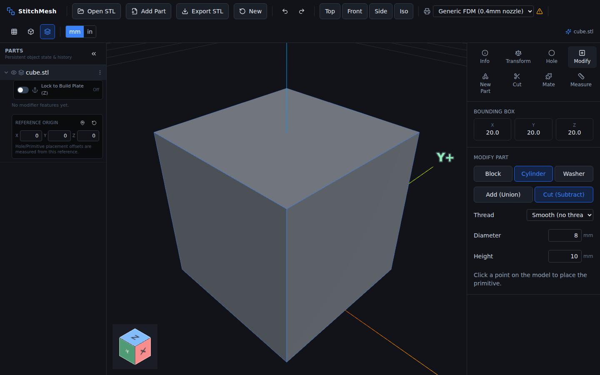

- **Shape**: Block / Cylinder / Washer / Chamfer. Chamfer is a cone —
  wide at the surface, narrowing to an inner diameter at depth — normally
  reached automatically via Quick Chamfer (§9a) rather than picked here,
  but it's a regular shape choice if you want to set one up by hand.
- **Operation**: **Add (Union)** fuses it onto the model as a new
  protrusion; **Cut (Subtract)** carves it out as a cavity.
- **Dimensions**: Block gets Width/Depth/Height; Cylinder gets
  Diameter/Height; Washer gets Outer/Inner Diameter/Height; Chamfer gets
  Diameter/Inner Diameter/Depth.
- **Thread** (Cylinder only): same dropdown as Hole. With **Add** it
  becomes an external thread (a boss/stud); with **Cut** an internal
  thread (a tapped hole) — the caption updates to say which.

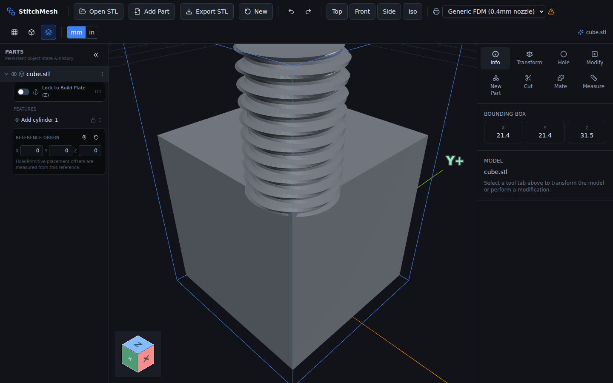

*M8 × 1.25, Add (Union), 12mm tall, placed on the top face. It shows up in
the Parts panel as "Add cylinder 1" under the target part.*

---

## 9a. Quick Chamfer & Counterbore

Tabs: **Chamfer** and **C-Bore**. These don't ask you to line anything up —
click near the opening of an existing **Hole** feature (§8) and StitchMesh
finds that hole's true centerline and diameter on its own, then hands off
to the Primitive panel (§9) with a cutter already placed and sized to match
it. It's a shortcut into Primitive, not a separate modifier: everything
after the click — the live preview, the editable fields, Apply/Cancel — is
the same Primitive workflow, just pre-filled.

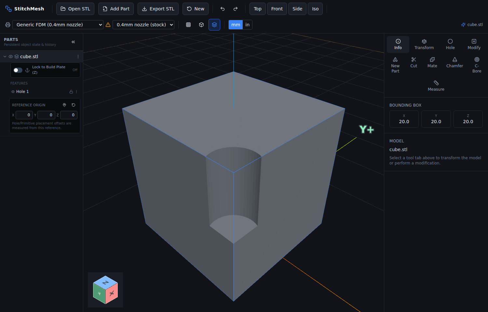

- **Click near a hole's opening**, on the face it opens through. StitchMesh
  looks for a Hole feature within about 1.5mm of the click and snaps to its
  axis — clicking empty space, or too far from any hole, does nothing (no
  error, just no handoff — try again closer to the opening).
- **Counterbore** pre-fills a straight cylindrical recess, centered and
  aligned on the hole's own axis:
  - **Diameter**: the hole's diameter × 1.6 — roomy enough for a typical
    bolt head or nut, adjust to match your actual hardware.
  - **Depth**: 4mm, or half the hole's own depth for a shallower/blind
    hole — whichever is smaller, so a counterbore can't accidentally cut
    all the way through it.
- **Chamfer** pre-fills a cone that blends into the hole with no visible
  step:
  - **Inner Diameter** is set to exactly match the hole's diameter.
  - **Diameter** (the wide, surface end) is Inner Diameter + 2mm.
  - **Depth** is set so the taper works out to a clean 45° bevel by
    construction (radius grows by the same amount as the depth).
- Every field stays editable afterward, same as any Primitive — change
  Diameter, Inner Diameter, or Depth and the preview updates live.
- If you narrow a Counterbore's Diameter or a Chamfer's Inner Diameter
  below the hole's own diameter, an amber warning appears under the field:
  the cutter would no longer fully clear the hole it's snapped to. This is
  advisory, not blocking — StitchMesh warns and lets you proceed, same as
  its other geometry warnings (§17, §20).
- **Either end, just by clicking nearer it.** For a through-hole, StitchMesh
  places the cutter at whichever opening your click actually landed closer
  to — click near the far side and it snaps there, not always the side the
  hole was originally drilled from.
- **Use the other end instead** — a button that appears whenever a through-
  hole was detected, right below the dimension fields. It swaps the current
  placement to the opposite opening without making you re-click, for when
  the end you actually want is awkward to reach from the current camera
  angle.
- **Both ends, in one click.** If the hole you snapped to goes all the way
  through the part, an **Also cut the opposite end** checkbox also appears
  below the fields. StitchMesh confirms this automatically — it probes just
  past the hole's far side to check whether material is actually there —
  so the checkbox only shows up for a genuine through-hole; a blind hole
  never offers it (nor the "other end" button above — a blind hole only has
  one valid opening). Check it and Apply creates two identical cuts, one at
  each opening, matched to the hole's own axis on both ends. It's off by
  default: leave it unchecked for the single-end behavior described above.


*A 6mm hole with a Counterbore snapped onto it — diameter and depth
pre-filled, ready for Apply or fine-tuning.*

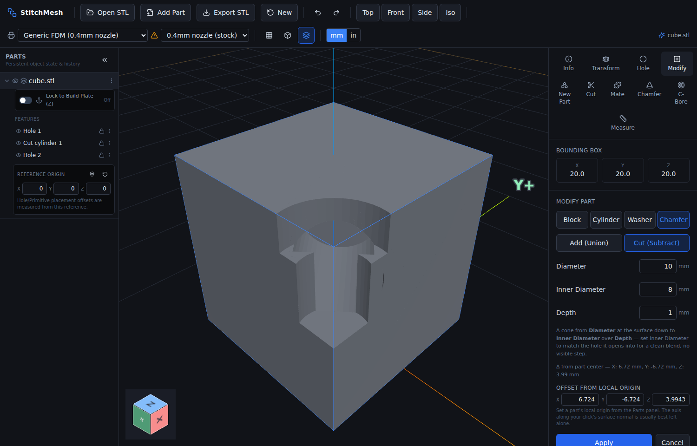

*Clicking the Chamfer tool near an 8mm hole hands off to Modify with
Diameter 10mm, Inner Diameter 8mm (exact match), and Depth 1mm already
filled in — a 45° bevel by construction. Apply as-is or adjust first.*

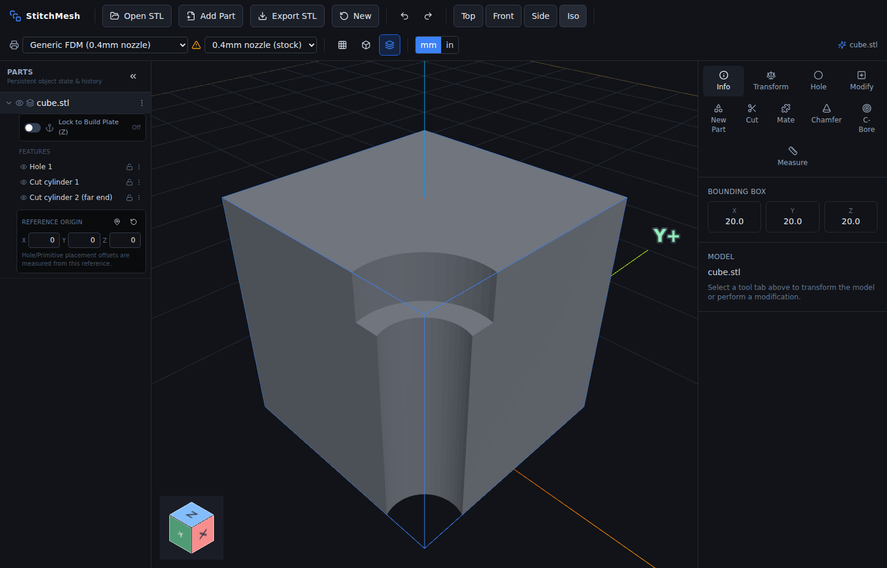

*A through-hole with "Also cut the opposite end" checked — Apply added
"Cut cylinder 1" at the near opening and "Cut cylinder 2 (far end)" at the
far one, both from a single click and a single Apply.*

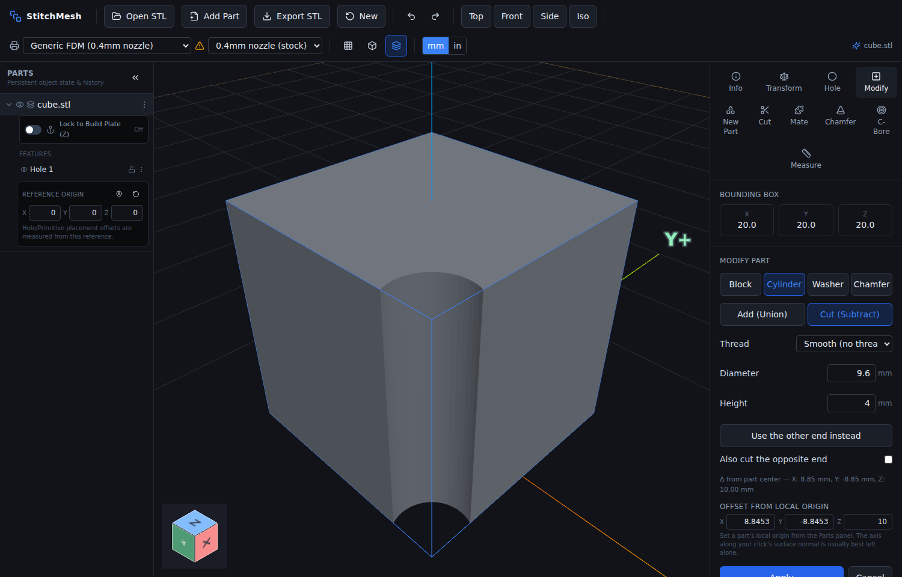

*A through-hole counterbore, both end-selection controls visible: "Use the
other end instead" (swaps this placement to the opposite opening) and
"Also cut the opposite end" (cuts both in one Apply) — both appear only
when StitchMesh has confirmed a real opening exists on the far side.*

---

## 10. Shapes toolbox

Tab: **Shapes**. Adds a brand-new **independent part** built from a basic
solid — different from Primitive (§9), which modifies an existing part.

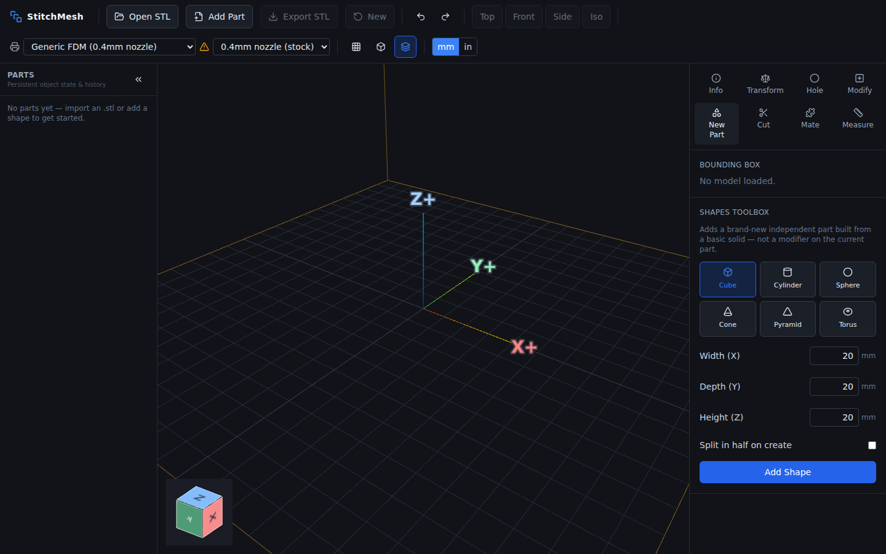

- **Shape**: Cube, Cylinder, Sphere, Cone, Pyramid, or Torus.
- **Dimensions**: fields change to match the shape (Width/Depth/Height for
  a cube; Diameter for a sphere; Diameter + Height for a cylinder, cone,
  or pyramid; Outer + Tube Diameter for a torus).
- **Split in half on create** — an optional checkbox with an axis
  picker: creates the shape and immediately slices it into two separate
  parts along that axis (the same math as Plane Cut, §13), sitting
  exactly where the whole shape would have been.
- **Add to Scene** (or **Add Shape** if nothing's loaded yet) — drops the
  new part beside whatever's already in the scene, or centered and on the
  build plate if it's the first thing you've added.

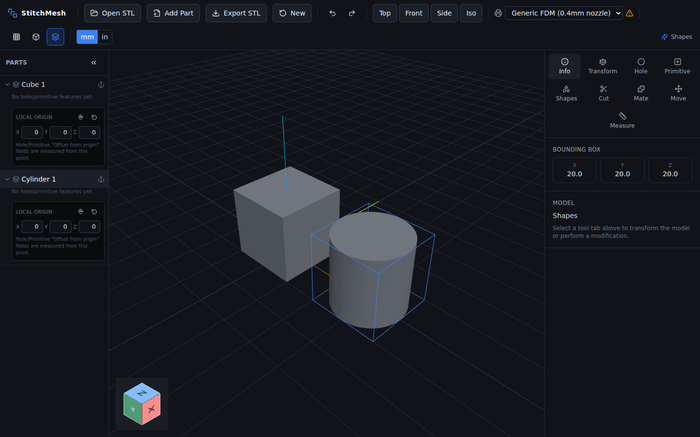

*A Cube and a Cylinder, each its own independent part in the Parts
panel — ready to be moved, mated, or modified separately.*

---

## 11. Mate & Weld

Tab: **Mate**. Positions one part against another — flush against a face,
coaxial with a hole/boss, or matched across several reference points —
while keeping them as two separate, independently movable parts. **Weld**
then permanently merges them, if you want that.

**Basic workflow**:

1. Click **Mate** → click a face on the **first (stationary)** part.
2. Click a face on the **second** part — the one that will move.
3. Click **Fit (flush faces)** — StitchMesh rotates and slides the second
   part so that face sits flush against the first, facing it.

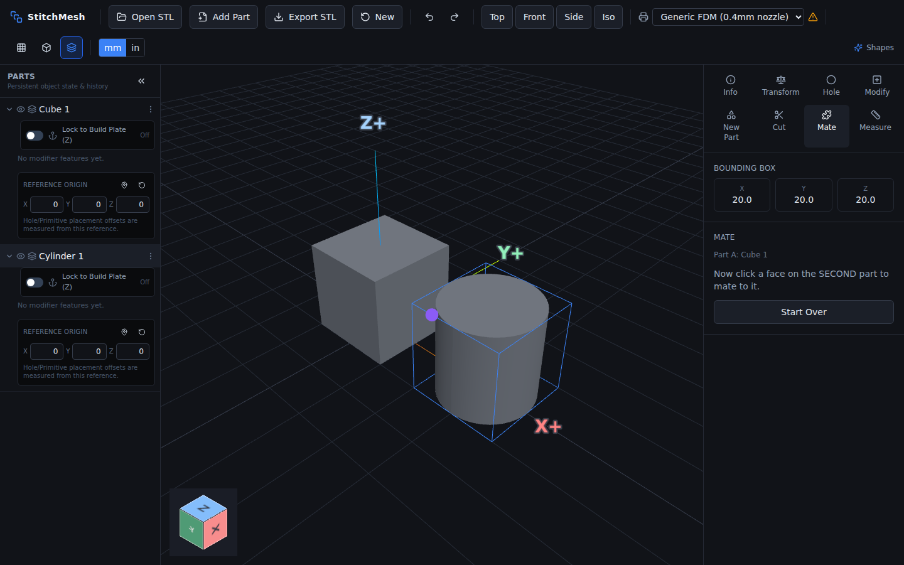

*After clicking a face on the first part, click a face on a different
part to mate it to.*

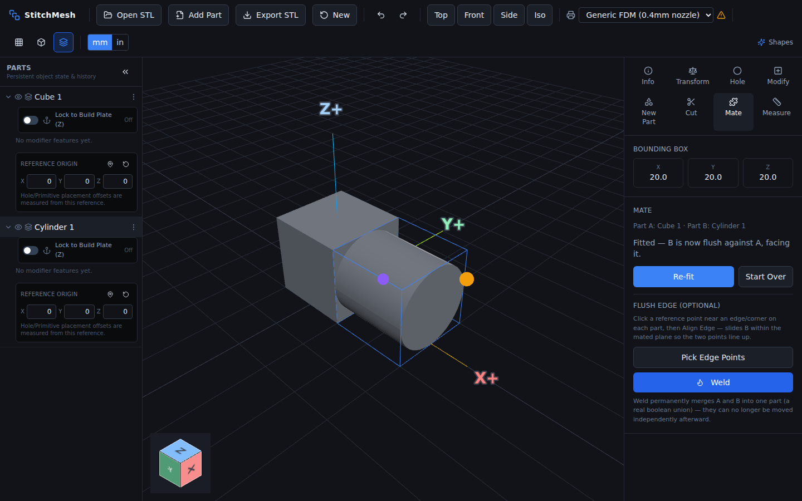

*A cylinder fitted flush against a cube's face — still two separate parts
in the Parts panel. **Re-fit** repeats the fit if you've moved something;
**Start Over** clears the picks and starts again.*

Because StitchMesh works on triangle meshes rather than true CAD faces, a
"face" here means whatever flat surface you click, and "flush" means the
two clicked surfaces' planes touch with their normals pointing at each
other — it works well for flat faces on blocks, bosses, and similar
shapes, and won't recognize curved or compound surfaces as a single face
the way a parametric CAD face would.

### Axis snap: picking a hole or boss instead of a flat face

As soon as the Mate tool is active, StitchMesh draws a dashed **centerline**
straight through the true axis of every Hole and round **Modify** primitive
(cylinder or washer) on every visible part — the same line you'd draw by
hand on a shop drawing to mark a hole's center. It runs the feature's full
length and a little past either end, so it's visible even where the axis
extends into open air above a surface, not just inside the material.

Click near a **Hole** feature or a round primitive instead of a flat spot —
or click the centerline itself, including where it runs through open space
past the surface — and the pick snaps to that feature's true centerline (its
stored surface point and true axis direction) rather than whatever raw point
you happened to click on its curved wall. The picked anchor shows a short
dashed marker line through it and the Mate panel tags it with its diameter,
e.g. "6.00mm axis" (shown with the diameter symbol in the app itself).
This is what makes coaxial fits (below) both possible and precise: a click
anywhere on a hole's rim — or its drawn centerline — reliably means "this
hole's axis," not "this one triangle on its wall." The centerlines disappear
again as soon as you leave the Mate tool.

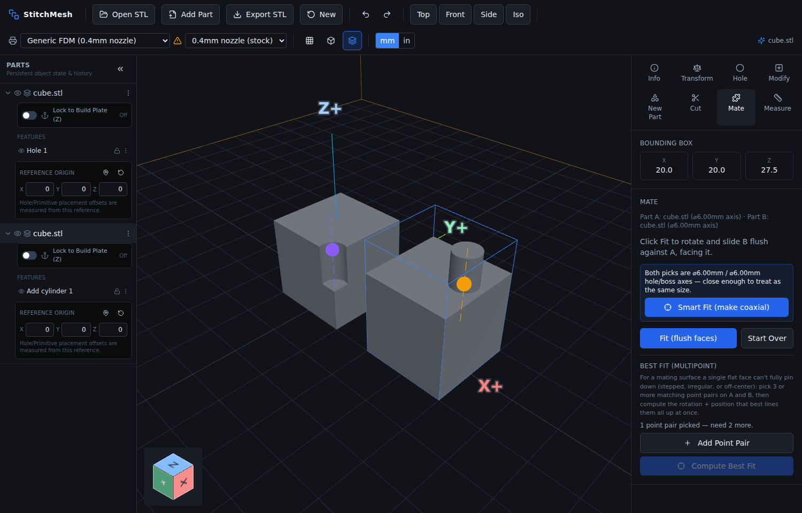

*A 6mm hole (purple marker + dashed axis line) and a 6mm boss (orange) —
both picks snapped to their true centerlines, and the panel recognizes
the matching diameters.*

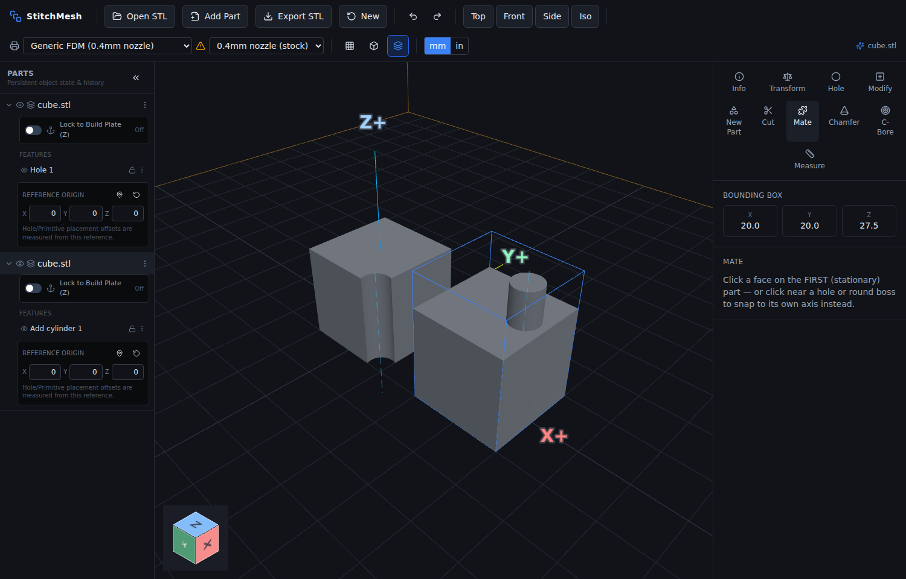

*The Mate tool active, nothing picked yet — a centerline already runs
through the hole on the left part and the boss on the right, both
directly clickable, including the stretch above the boss's own top where
there's no mesh at all underneath the cursor.*

### Smart Fit — coaxial (pin into a matching hole)

When **both** picks snap to a hole/boss axis **and** their diameters are
close enough to treat as the same size (within 0.3mm), the panel offers a
highlighted **Smart Fit (make coaxial)** button in place of (alongside)
the regular Fit. It rotates and slides the second part so its axis becomes
coincident with the first's — a boss/pin lines up straight into its
matching hole — while leaving how far it's inserted along that axis
exactly where it already was, since that's a real choice, not something
to silently reset. Adjust the insertion depth afterward with a normal
drag, the Position field, or Snap to Grid.

This is deliberately conservative: it only fires on an explicit click of
a clearly-labeled button, and only when both anchors are genuine axis
picks with genuinely close diameters — it won't guess at a fit from
flat-face picks or mismatched sizes, and nothing about it is automatic
or silent.

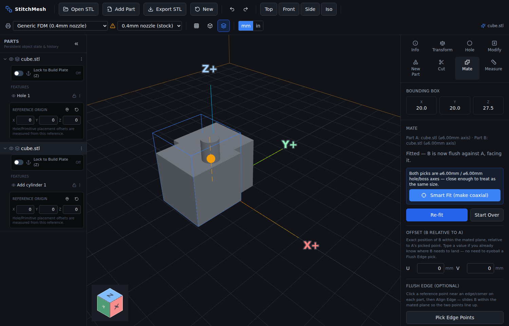

*After Smart Fit: the boss sits inside the hole, both markers now
coincide, and the offset shows U=0/V=0 — exactly coaxial.*

### Offset (B relative to A) — type an exact position

Once fitted (by any method below), the panel shows **U** and **V** fields
— B's current position relative to A's picked point, resolved into a
fixed pair of in-plane directions. If you already know exactly where B
needs to land (a hole's exact offset from an edge, say), type it directly
instead of eyeballing a drag or a Flush Edge pick — the part moves live as
you type, within the mated plane only (it never breaks flush contact).

- **Flush Edge (optional)** — the click-based alternative: click **Pick
  Edge Points**, then a reference point near an edge or corner on each
  part. **Align Edge** slides B within the mated plane so those two points
  line up — useful when you want to match a physical edge visually rather
  than type a number. This is a point-to-point alignment, not true edge
  detection, so pick points as close to the actual edge/corner as you can.

### Best Fit (multipoint)

For a mating surface a single flat face or axis can't fully pin down —
stepped, irregular, or where the surfaces are only approximately flat —
pick **3 or more** corresponding point pairs on A and B (the initial pick
from step 1–2 above always counts as pair #1; **Add Point Pair** walks you
through picking more, on A then the matching point on B). **Compute Best
Fit** then solves the single rotation + position that best lines up *all*
the picked pairs at once (a least-squares rigid fit — the Kabsch
algorithm), rather than reasoning from a single face normal. A pick near a
hole/boss still snaps to its axis point the same way, so "the center of
this hole on both parts" is an easy, precise pair to add. **Remove last
pair** undoes the most recent pick if you want to redo it.

- **Weld** — a real boolean union that permanently merges the two mated
  parts into one, however they were positioned (Fit, Smart Fit, Best Fit,
  or a manual offset). They can no longer be moved independently
  afterward, and neither part's prior feature layers (§6) carry over as
  separately editable on the merged result.

---

## 12. Plane Cut

Tab: **Cut**. Splits the target part into **two independent, separately
selectable parts** along an axis-aligned plane.

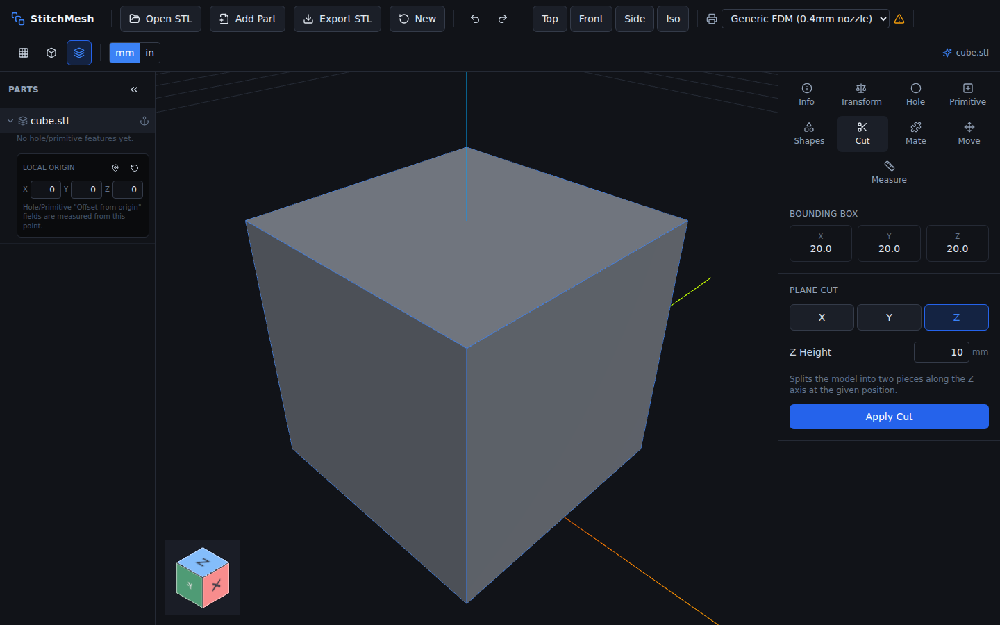

- **Part** selector — only shown once more than one part exists.
- **Axis** — X / Y / Z, the cutting plane's normal.
- **Height** — the plane's position on that axis. Auto-defaults to the
  target's actual center whenever you open the tool or change axis (a
  model sits on the build plate, so a fixed 0 default would cut at the
  very bottom edge and remove nothing).
- **Apply Cut** — both resulting pieces are kept, appear as two new
  entries in the Parts panel labeled `(upper)` and `(lower)`, and are
  exported together. They start out sitting exactly where the original
  was — see the Move tool to actually pull them apart. Neither piece
  carries over the original part's feature layers as editable — the cut
  bakes the shape as it stood at that moment into each new piece's own
  base.

---

## 13. Transform and Move

Tab: **Move**. Selects a part and repositions it — either directly in the
viewport, or with the numeric fields.

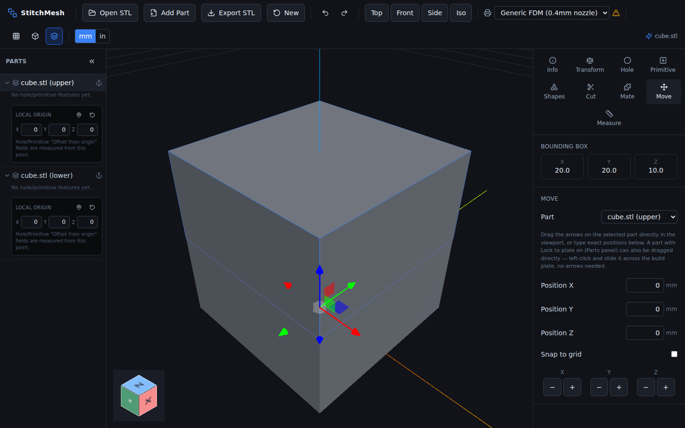

*Right after a Plane Cut: two selectable parts exist in the Parts panel
(`cube.stl (upper)` / `(lower)`), but they still occupy the same space. Their positions can be separated directly from Transform.*

- **Drag gizmo** — the selected part gets colored arrows (and a small
  plane handle) directly in the viewport. Drag an arrow to move along
  just that axis, or the plane handle to move in two axes at once.
- **Left-click-drag directly on a locked part** — if the part has
  **Lock to plate** on (§6), you don't need the gizmo arrows at all: just
  left-click anywhere on the part and drag — it slides across the build
  plate in X/Y, Z always pinned.


*Red (X) and green (Y) arrows and a blue plane-handle square on the
selected part. Since this part is locked to plate, there's no blue Z
arrow — dragging is constrained to the build plate automatically.*

- The selected part is taken directly from the Parts panel. There is no separate Move tab to revisit just to change position.
- **Position X / Y / Z** — absolute position; typing a value moves the
  part there directly. Z is disabled while Lock to plate is on.
- **Snap to grid** — checkbox; when on, typed positions and drags round to
  the nearest 1mm (or your chosen grid size).
- **Nudge buttons** (−/+ per axis) — step by the grid size.

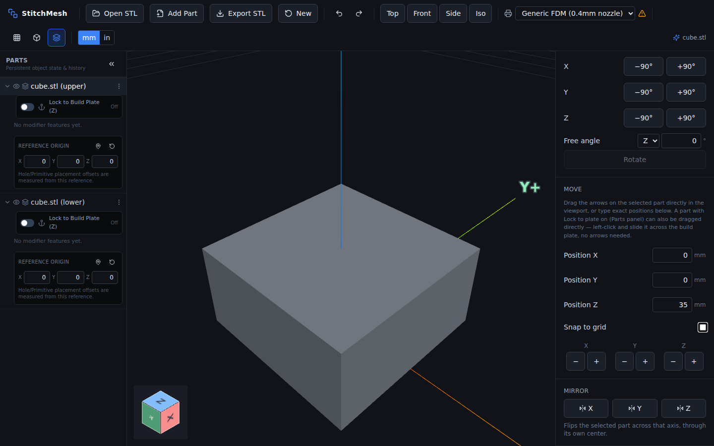

*The `(upper)` piece moved to Z=35: the two halves are now visibly
separate, independently selectable, and still export together.*

---

## 14. Measurement tool

Tab: **Measure**. Click a **datum** (reference point), then click a second
point to read the distance and per-axis offset — useful for checking
clearances before committing to a hole or thread size.

**Workflow**: click **Measure** → click a point on the model (sets the
green datum marker) → click another point (orange marker + a white
connecting line) → the panel shows straight-line **Distance** and
**ΔX / ΔY / ΔZ**. Click again anywhere to re-measure from the same datum
without resetting it. **Reset Datum** clears both points.

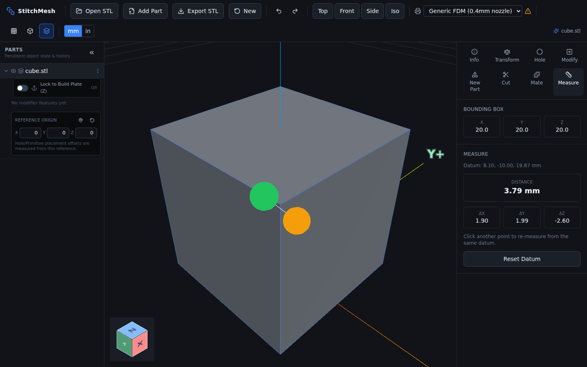

*Datum (green) and measured point (orange) on the same cube, with the
distance and per-axis deltas shown in the panel.*

---

## 15. Mesh validation & auto-repair

Every import — the first model or an added part — is checked for two
kinds of defect and handled differently:

- **Inconsistent or inverted face winding** (a common real-world defect —
  a few faces flipped, or occasionally an entire mesh reading inside-out)
  is detected and **automatically repaired**, silently, before you ever
  see the model. This matters because StitchMesh's click-to-place tools
  read the *actual* face winding to know which way is "outward" — an
  unrepaired flipped face would drill in the wrong direction. Repair runs
  in two passes: a local pass that unifies winding within each connected
  patch of geometry (by majority vote against its neighbors), then a
  global pass that flips the whole mesh if it still reads inside-out
  overall.
- **Open boundary edges** (holes) or **non-manifold edges** (edges shared
  by three or more triangles — not a valid solid) are **not** auto-fixed,
  since closing a hole means guessing a shape. Instead, a dismissible
  banner appears in the toolbar.

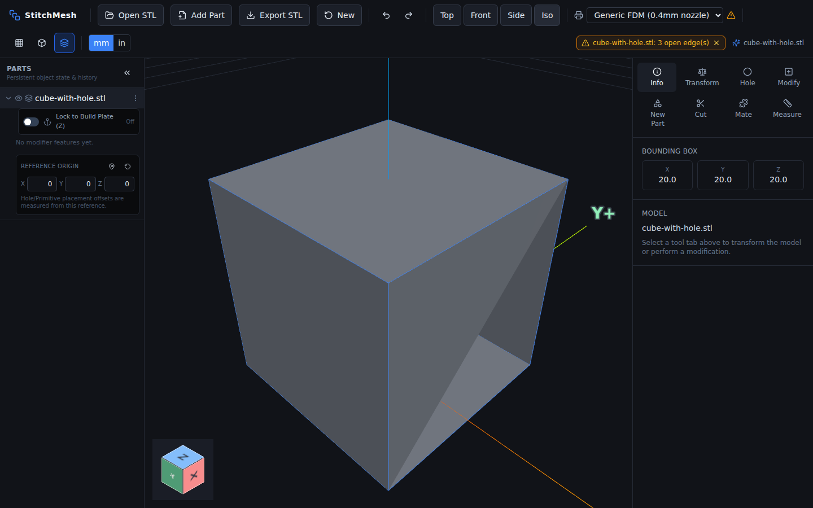

*A model with one triangle deliberately removed: "cube-with-hole.stl: 3
open edge(s)" with a dismiss (✕) button. The banner is informational only
— StitchMesh doesn't attempt to fill the hole automatically.*

---

## 16. Thread generator & standard sizes

Both the Hole and Primitive (cylinder) tools share one **Thread** dropdown
with three groups:

- **Metric (ISO)**: M2, M2.5, M3, M4, M5, M6, M8, M10, M12, M14, M16, M18, M20 (coarse pitch)
- **Unified Coarse (UNC)**: #4-40, #6-32, #8-32, #10-24, 1/4-20, 5/16-18, 3/8-16, 7/16-14, 1/2-13, 5/8-11, 3/4-10
- **Unified Fine (UNF)**: #4-48, #6-40, #8-36, #10-32, 1/4-28, 5/16-24, 3/8-24, 7/16-20, 1/2-20, 5/8-18, 3/4-16

Picking a size generates an actual helical 60° V-thread mesh, from the
fundamental-triangle geometry both standards share (ISO 68-1 for metric,
ASME B1.1 for Unified):

```
H (fundamental triangle height) = 0.866025 × pitch
pitch diameter                  = major diameter − 0.649519 × pitch
minor diameter                  = major diameter − 1.082532 × pitch
crest truncated by H/8, root truncated by H/4
```

These constants were cross-checked against known published table values
(M6×1.0 → minor diameter 4.917mm; M10×1.5 → pitch diameter 9.026mm) — both
matched exactly. An internal (tapped) thread and an external (screw)
thread are the *same* nominal profile — the generator is reused as a
subtraction cutter for one and a union addition for the other, exactly
like a real tap cuts the mating shape of the bolt it's sized for. See
`src/utils/threadGeometry.ts` for the profile math and
`src/utils/threadStandards.ts` for the size table.

---

## 17. Printer profiles

The toolbar's **Printer** dropdown scales the whole working environment to
a specific machine and tunes every threaded feature to it:

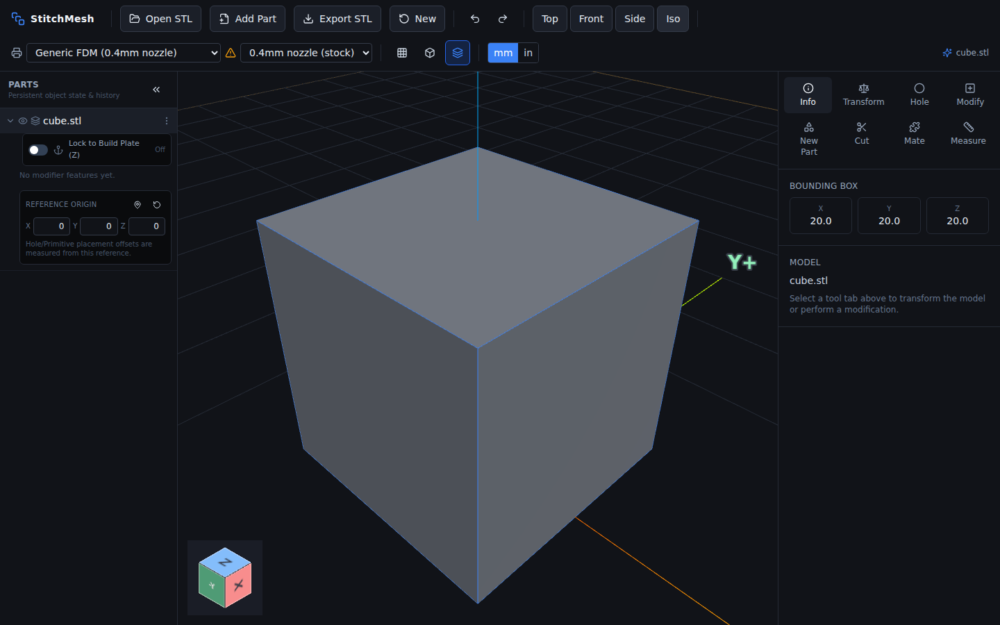

*Default: "Generic FDM (0.4mm nozzle)" with a warning triangle — shown
whenever Generic is active, confirmed or not, since the underlying concern
(no machine-specific tuning) is still true either way.*

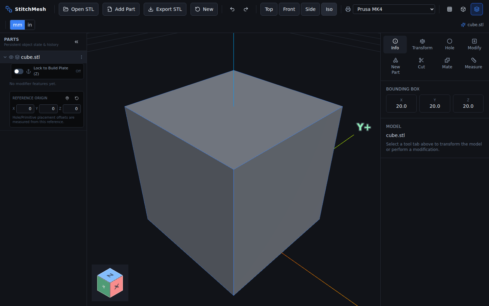

*After picking "Prusa MK4": the warning icon clears.*

What the profile changes:

- **Build plate and printable envelope** — the grid resizes to the
  machine's actual bed footprint, and a faint amber wireframe box in the
  viewport marks the full printable volume (bed footprint × max height),
  so you can see at a glance whether a model fits — not just guess from a
  number. Switching printers rescales both immediately.
- **Build-volume warning** — if the combined, visible parts in the scene
  no longer fit inside the selected printer's envelope, the toolbar shows
  a red warning icon and the Info panel's Bounding Box section names which
  axis (or axes) overflow and by how much. Export STL also stops to
  confirm before proceeding if the model doesn't fit — a last check before
  you'd otherwise find out on the printer.
- **Mesh resolution** — radial facets and helical height-rings sized to
  the printer's nozzle/spot diameter and typical layer height.
- **Internal-thread clearance** — a small diametral clearance added to
  tapped holes (0.25–0.35mm for FDM depending on machine, 0.1mm for resin)
  so a print accepts a real bolt despite typical over-extrusion.
- **Printability warning** — in the Thread panel, when a pitch is finer
  than the nozzle can resolve, or the size is small enough (below roughly
  M4/#8) that a threaded insert would print more reliably.

### Nozzle diameter override

A second dropdown appears next to the printer selector for any FDM
machine — pick a different nozzle size if you've swapped in one other than
the printer's stock nozzle (a 0.2mm nozzle for finer detail, or a 0.6/0.8mm
one for faster, chunkier prints). This isn't cosmetic: nozzle diameter
directly bounds how fine a thread crest/root the machine can resolve and
what a sane layer height range is, so switching it changes the mesh
resolution, printability warnings, and recommended layer height the same
way picking a different printer would. Each printer offers the nozzle
sizes actually documented for it (FlashForge's AD5X-style hotend swaps to
0.25/0.6/0.8mm rather than the more common 0.2mm, for example); the
dropdown is hidden entirely for resin printers, where there's no
user-swappable nozzle — the spot size is fixed by the LCD/optics.

### Included printers

Every profile below is sourced from the manufacturer's own published specs
(build volume, stock nozzle, layer height range) cross-checked against
independent retailer/review listings — a printer is only included when
those numbers were unambiguous and consistent, which is why the earlier,
shorter list didn't grow indiscriminately.

**FDM:** Generic FDM (0.4mm), Bambu Lab X1 Carbon, Bambu Lab P1S, Bambu Lab
A1, Bambu Lab A1 mini, Prusa MK4, Prusa MINI+, Creality Ender 3 V2,
Creality Ender-3 S1 Pro, Creality K1C, Creality K1 Max, FlashForge
Adventurer 5M, FlashForge Adventurer 5M Pro, Anycubic Kobra 3, QIDI X-Max
3, Voron 2.4 (350mm), Ultimaker S5.

**Resin:** Elegoo Saturn 3, Elegoo Saturn 4 Ultra, Anycubic Photon Mono
M5s, Formlabs Form 4.

---

## 18. Why the Parts-first workflow matters

StitchMesh deliberately separates **persistent object state** from **temporary operations**:

- The **Parts panel** answers: *What objects are in the scene, which are visible, which are protected, and what modifications belong to each object?*
- The **viewport** answers: *What am I looking at and where am I clicking?*
- The **right sidebar** answers: *How should the current operation behave?*

This keeps the interface from becoming a second toolbox inside the object list. Persistent state stays visible on the left; operation parameters stay on the right. Context menus provide shortcuts without duplicating every tool in every part row.

### Recommended workflow

1. Select a part in the Parts panel.
2. Use the eye/anchor/lock controls to establish its persistent state.
3. Right-click the part for a direct shortcut such as **Add hole**, **Modify part**, or **Transform**.
4. Configure the operation in the right sidebar.
5. Name important features so a later edit is understandable.
6. Hide or isolate other parts when inspecting a tight assembly.
7. Use **Measure** before committing a dimension that must fit another part.

## 19. Every control, at a glance

| Location | Control | Does |
|---|---|---|
| Toolbar | Open STL | Import an `.stl`, replacing the scene (drag-and-drop works too) |
| Toolbar | Add Part | Import an `.stl` as a new independent object |
| Toolbar | Export STL | Save the current scene as a new `.stl` |
| Toolbar | New | Clear the model (confirms first) |
| Toolbar | Undo / Redo | Step back/forward through edit history (`Ctrl+Z` / `Ctrl+Y`) |
| Toolbar | Top / Front / Side / Iso | Jump to a preset camera framing (`1`–`4`) |
| Toolbar | mm / in | Switch every length field between millimeters and inches |
| Toolbar | Printer dropdown | Select target printer; tunes thread resolution/clearance |
| Toolbar | Wireframe / Flat shading / Bounding box | Display toggles (`W` / — / `B`) |
| Parts panel | Part row | Select the active part; expand/collapse its feature history |
| Parts panel | Eye icon | Show/hide a part |
| Parts panel | Lock to Build Plate (Z) toggle | Toggle the part's Z-axis lock to the build plate |
| Parts panel | Part lock icon | Prevent movement/transformation until unlocked |
| Parts panel | Actions / right-click | Rename, duplicate, isolate, show all, jump to tools, or delete |
| Parts panel | Feature eye | Show/hide an individual modifier feature |
| Parts panel | Feature row | Reopen/focus a Hole/Primitive for editing |
| Parts panel | Feature lock | Freeze/unfreeze a feature against edits |
| Parts panel | Feature menu | Rename, focus, hide/show, lock/unlock, or delete |
| Parts panel | Pin / Reset / X,Y,Z | Set, reset, or type a part's reference origin |
| Parts panel | `«` / `»` | Collapse/expand the whole panel |
| Viewport | Middle-drag | Orbit (re-centers on what's under the cursor) |
| Viewport | Right-drag | Pan |
| Viewport | Scroll | Zoom |
| Viewport | Left-click-drag on a locked part | Slide it across the build plate |
| Viewport | Bottom-left cube | Shows current view orientation (X/Y/Z labeled faces) |
| Sidebar → Info | (read-only) | File name, selected part's bounding box |
| Sidebar → Transform | Scale X/Y/Z, Uniform | Resize the selected part |
| Sidebar → Transform | Rotate ±90° (×3 axes), Free angle | Rotate the selected part |
| Sidebar → Transform | Position X/Y/Z, Center, Drop to Plate | Reposition the selected part |
| Sidebar → Transform | Mirror X/Y/Z | Flip the selected part |
| Sidebar → Hole | Diameter, Depth, Thread | Configure a hole cutter after clicking a point |
| Sidebar → Hole | Offset from local origin X/Y/Z | Fine-tune placement numerically |
| Sidebar → Hole | Apply Boolean Subtract / Save Changes / Cancel / Delete Feature | Commit, update, discard, or remove |
| Sidebar → Modify | Shape, Operation, dimensions, Thread | Configure a modifier after clicking a point |
| Sidebar → Primitive | Apply / Save Changes / Cancel / Delete Feature | Commit, update, discard, or remove |
| Sidebar → New Part | Shape, dimensions, Split in half | Configure a new standalone part |
| Sidebar → Shapes | Add to Scene | Create the new part |
| Sidebar → Cut | Part, Axis, Height, Apply Cut | Split the target part in two |
| Sidebar → Mate | (click two faces) | Pick which parts and faces to mate |
| Sidebar → Mate | Fit / Re-fit | Rotate + slide part B flush against part A |
| Sidebar → Mate | Pick Edge Points, Align Edge | Fine-align B within the mated plane |
| Sidebar → Mate | Weld | Permanently merge A and B into one part |
| Sidebar → Measure | (click viewport) | Set datum, measure distance/deltas |

---

## 20. Accuracy & validity review

A full-codebase review (an automated correctness pass, plus manual
re-derivation of the placement math for every tool) has been run across
several rounds of this project's development. All findings below are
**already fixed**.

**From earlier passes:**
1. **Hole/Primitive depth was silently halved** — the cutter was centered
   on the clicked point instead of driven into the surface. Fixed;
   confirmed by drilling a hole deeper than the material and verifying it
   broke through the far face.
2. **Plane Cut's default height (0) was a silent no-op** on any
   build-plate-dropped model. Fixed to auto-default to the target's
   actual center.
3. A coordinate-space bug that could silently miss a boolean entirely
   after a prior scale/rotate. Fixed.
4. **Transform previously acted on the whole scene instead of the
   selected part** — scaling or dropping one part after moving another
   moved or resized both. Root-caused to Hole/Primitive booleans baking
   each part's *world* transform into its geometry; fixed by compositing
   features entirely in each part's own stable local frame, verified by
   scaling/rotating/centering/dropping one part of a two-part scene and
   confirming the other's position stayed byte-for-byte identical. The
   same fix closed a latent Mirror bug (mirroring an off-center part used
   to relocate it instead of flipping it in place).
5. Mesh repair, undo/redo, snap-to-grid, free-angle rotation, and the full
   feature-layer lifecycle (add/edit/lock/delete) were each verified with
   dedicated synthetic tests — all correct.

**From this pass (controls, Mate/Weld, Shapes, units, lock-to-plate):**
- **Negative-number input** — typing a leading "-" (or a bare ".") into
  any numeric field used to be immediately overwritten back to the old
  value, because the field re-derived its display text from
  `parseFloat()` on every keystroke. Fixed by only re-syncing a field's
  displayed text from its committed value while the field is *not*
  focused; verified by typing "-1" mid-keystroke and confirming the
  minus sign survives, then completing "-12.5" and confirming it commits
  correctly.
- **Units conversion** — verified a 20mm cube reads exactly 0.787in after
  switching units, and that typed values round-trip correctly in both
  directions.
- **Mate + Weld** — verified end-to-end: picking a face on each of two
  parts, Fit (confirmed the parts stay separate, same part count),
  and Weld (confirmed it merges them into exactly one part).
- **Shapes toolbox** — verified each shape adds a correctly-labeled,
  independent part, and that "split in half on create" produces two
  separate `(upper)`/`(lower)` pieces.
- **Lock to plate + left-click-drag** — verified that enabling it snaps
  the part to Z=0, that left-click-dragging the part (no gizmo arrows
  needed) moves its X/Y position, and that this same left-click-drag does
  *nothing* on an unlocked part or empty space (no accidental orbit or
  move).
- **Orbit control change** — verified left-click-drag no longer rotates
  the camera at all (pixel-identical before/after), middle-click-drag
  still orbits, and right-click-drag still pans.
- **Regression pass**: the full previous feature set (parts/layers,
  mesh repair, Mirror, Plane Cut + Move, undo/redo, Hole feature edit/
  lock/delete) was re-run end-to-end after all of the above changes with
  no failures.

**Everything was re-verified end-to-end** in a real browser, offline, with
**zero console errors** across every test.

**Known limitations** (not bugs, but worth knowing):

- **No hole-filling.** Mesh repair fixes winding but doesn't attempt to
  triangulate and close actual holes/non-manifold topology — those are
  reported, not fixed.
- **Thread mesh triangle counts scale up fast.** A fine-pitch thread over
  a long depth can generate 10,000+ triangles.
- **Scaling a part flattens its existing features**, and **Plane Cut,
  Mirror, and Weld don't preserve feature layers** either — all four
  operate on the part's current compiled shape and produce a new base
  with no separately editable feature history.
- **Mate's "Flush Edge" is point-to-point, not true edge detection** —
  it aligns two clicked reference points within the mated plane, which
  works well for corners and straight edges on typical hardware shapes
  but doesn't recognize curved or compound edges as a single entity.
- **No feature reordering.** Features composite in the order you added
  them; there's no drag-to-reorder yet.
- **Snap-to-grid applies to the Move tool only**, not to Hole/Primitive
  click placement.
- **Single-level undo/redo stack**, capped at 25 steps.

---

## 21. Possible future features

Most of what was on this list in earlier revisions of this manual is now
built. What's still genuinely missing, for a future pass:

1. **Hole-filling / non-manifold repair** — closing actual holes, not just
   fixing winding.
2. **A rotate/scale mode for the viewport gizmo**, alongside the current
   translate-only drag handles.
3. **True edge/face detection for Mate**, instead of point-and-normal
   picking.
4. **Feature reordering** — drag a layer up/down in the Parts panel to
   change the order features composite in.
5. **Text/label embossing** onto a surface.
6. **Per-vertex or sculpting-level editing** — StitchMesh is deliberately
   scoped to primitive-based modification, not freeform mesh editing.
7. **Saved/named printer profiles** beyond the built-in list (custom
   nozzle diameter, layer height).

---

Thanks for using StitchMesh. *Modify, don't model.*
